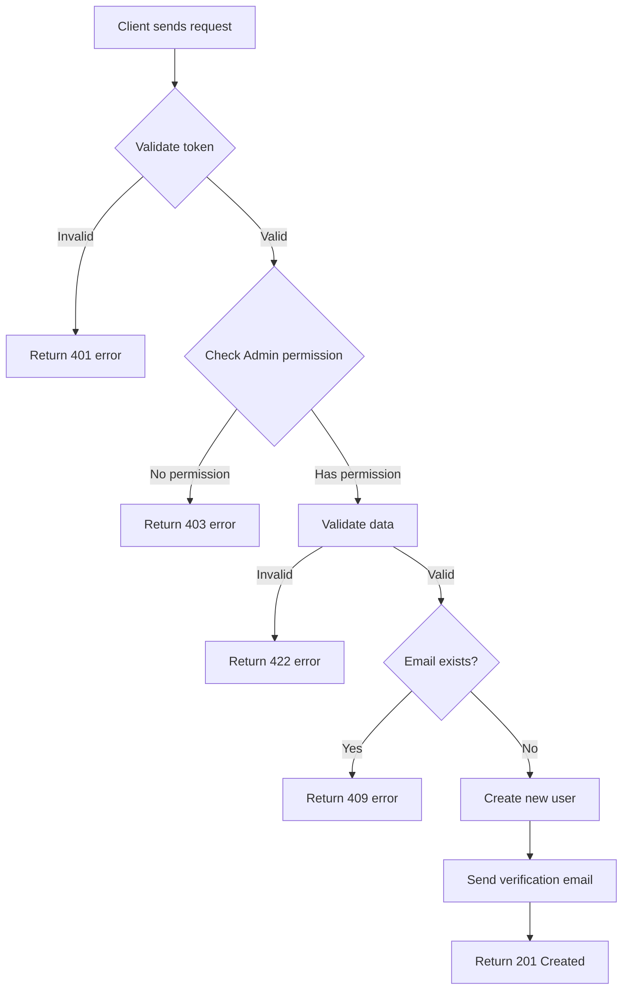

This document describes the standard structure for writing documentation in large projects. The goal is to ensure consistency, maintainability, and clarity for all team members.

> [!NOTE]
> This entire document uses **User Management API** as an illustrative example throughout. When applying to your project, replace with your corresponding domain/module.

<!--more-->

## Overview

Each document in the project should follow this structure:

1. **Introduction** - Overview of the feature/module
2. **Business Logic** - Explanation of business processes
3. **Implementation Logic** - Technical implementation details
4. **API Reference** - Complete API documentation (CRUD: Create, Read, Update, Delete)
5. **Testing** - Testing guidelines
6. **Troubleshooting** - Common issue resolution

---

## 1. Introduction

This section provides an overview of the feature or module.

### Purpose

Briefly describe the purpose of this feature in the system.

> **Example (User Management):** The User Management module provides user management functionality in the system, including creating, updating, deleting, and querying user information.

### Scope

- What this feature **can do**
- What this feature **cannot do**
- Related modules/services

### Prerequisites

| Requirement | Version | Notes |
| :---------- | :------ | :---- |
| Node.js | >= 18.0 | Required |
| Redis | >= 7.0 | For caching |
| PostgreSQL | >= 15 | Primary database |

---

## 2. Business Logic

### Business Process

Describe the main business flow of the feature using a diagram.

> **Example (User Management):** Process flow for creating a new user:



### Business Rules

| # | Rule | Description |
| :- | :--- | :---------- |
| 1 | Authentication required | All requests must have a valid token |
| 2 | Rate limiting | Maximum 100 requests/minute/user |
| 3 | Validation | Input data must pass validation |

### Special Cases

- **Case 1**: When user hasn't verified email → Allow read-only, no write operations
- **Case 2**: When system is overloaded → Return 503 with retry-after header

---

## 3. Implementation Logic

### Technical Architecture

```
┌─────────────────┐     ┌─────────────────┐     ┌─────────────────┐
│   API Gateway   │────▶│   Auth Service  │────▶│   User Service  │
└─────────────────┘     └─────────────────┘     └─────────────────┘
         │                                               │
         │                                               ▼
         │                                      ┌─────────────────┐
         └─────────────────────────────────────▶│    Database     │
                                                └─────────────────┘
```

### Detailed Processing Flow



### Step 1: Receive Request

Client sends request to API Gateway. Gateway performs:
- Validate request format
- Extract JWT token from header
- Forward to corresponding service

### Step 2: Authentication

Auth Service checks:
- Is the token valid?
- Has the token expired?
- Does the user have access rights?

### Step 3: Process Business Logic

Service processes business logic:
- Validate input data
- Execute business logic
- Interact with database

### Step 4: Return Result

Package response and return to client with standard format.



### Directory Structure


  
    
      
      
    
    
      
      
    
    
      
    
    
      
      
    
  


---

## 4. API Reference

> [!NOTE]
> This section demonstrates how to write complete API documentation with 5 basic CRUD endpoints. The example uses **User Management API**.

### Endpoint Overview

| Method | Endpoint | Description | Permission |
| :----- | :------- | :---------- | :--------- |
| `GET` | `/api/v1/users` | List users (with pagination) | Admin |
| `GET` | `/api/v1/users/{id}` | Get user details | User/Admin |
| `POST` | `/api/v1/users` | Create new user | Admin |
| `PUT` | `/api/v1/users/{id}` | Update user information | User/Admin |
| `DELETE` | `/api/v1/users/{id}` | Delete user | Admin |

---

### 4.1 List Users

Get a list of users with pagination, filtering, and sorting support.

#### Basic Information

| Property | Value |
| :------- | :---- |
| **Method** | `GET` |
| **URL** | `/api/v1/users` |
| **Authentication** | Bearer Token (Admin) |

#### Query Parameters

| Parameter | Type | Required | Description | Default |
| :-------- | :--- | :------- | :---------- | :------ |
| `page` | integer | ❌ | Page number (starting from 1) | `1` |
| `limit` | integer | ❌ | Records per page (max 100) | `20` |
| `sort` | string | ❌ | Sort field: `createdAt`, `email`, `fullName` | `createdAt` |
| `order` | string | ❌ | Order: `asc` or `desc` | `desc` |
| `status` | string | ❌ | Filter by status: `active`, `pending_verification`, `suspended` | - |
| `role` | string | ❌ | Filter by role: `user`, `admin`, `moderator` | - |
| `search` | string | ❌ | Search by email or name | - |

#### Headers

| Header | Type | Required | Description |
| :----- | :--- | :------- | :---------- |
| `Authorization` | string | ✅ | Authentication token. Format: `Bearer <token>` |
| `X-Request-ID` | string | ❌ | ID for request tracking |

#### cURL

```bash
curl --request GET \
  --url 'https://api.example.com/api/v1/users?page=1&limit=10&status=active&sort=createdAt&order=desc' \
  --header 'Authorization: Bearer <your_admin_token>'
```

#### Success Response

**Status Code:** `200 OK`

```json
{
  "success": true,
  "data": [
    {
      "id": "usr_01HQ3K5XJPZ8VWMN4YGCR2BDEF",
      "email": "user1@example.com",
      "fullName": "John Doe",
      "role": "user",
      "status": "active",
      "createdAt": "2024-02-20T10:30:00.000Z"
    },
    {
      "id": "usr_01HQ3K5XJPZ8VWMN4YGCR2BGHI",
      "email": "user2@example.com",
      "fullName": "Jane Smith",
      "role": "admin",
      "status": "active",
      "createdAt": "2024-02-19T08:00:00.000Z"
    }
  ],
  "pagination": {
    "page": 1,
    "limit": 10,
    "totalItems": 156,
    "totalPages": 16,
    "hasNextPage": true,
    "hasPrevPage": false
  },
  "meta": {
    "requestId": "req-345678",
    "timestamp": "2024-02-20T10:40:00.000Z"
  }
}
```

#### Error Responses




```json
{
  "success": false,
  "error": {
    "code": "UNAUTHORIZED",
    "message": "Token is invalid or has expired"
  },
  "meta": {
    "requestId": "req-345678",
    "timestamp": "2024-02-20T10:40:00.000Z"
  }
}
```



```json
{
  "success": false,
  "error": {
    "code": "FORBIDDEN",
    "message": "Access denied",
    "details": "Only Admin can view user list"
  },
  "meta": {
    "requestId": "req-345678",
    "timestamp": "2024-02-20T10:40:00.000Z"
  }
}
```




---

### 4.2 Get User Details

Get detailed information of a user by ID.

#### Basic Information

| Property | Value |
| :------- | :---- |
| **Method** | `GET` |
| **URL** | `/api/v1/users/{id}` |
| **Authentication** | Bearer Token |

#### Path Parameters

| Parameter | Type | Required | Description |
| :-------- | :--- | :------- | :---------- |
| `id` | string | ✅ | User ID. Format: `usr_<ULID>` |

#### Headers

| Header | Type | Required | Description |
| :----- | :--- | :------- | :---------- |
| `Authorization` | string | ✅ | Authentication token. Format: `Bearer <token>` |

#### cURL

```bash
curl --request GET \
  --url 'https://api.example.com/api/v1/users/usr_01HQ3K5XJPZ8VWMN4YGCR2BDEF' \
  --header 'Authorization: Bearer <your_token>'
```

#### Success Response

**Status Code:** `200 OK`

```json
{
  "success": true,
  "data": {
    "id": "usr_01HQ3K5XJPZ8VWMN4YGCR2BDEF",
    "email": "user@example.com",
    "fullName": "John Doe",
    "phoneNumber": "+14155551234",
    "role": "user",
    "status": "active",
    "metadata": {
      "department": "Engineering",
      "employeeId": "EMP001"
    },
    "lastLoginAt": "2024-02-20T09:00:00.000Z",
    "createdAt": "2024-02-15T10:30:00.000Z",
    "updatedAt": "2024-02-20T09:00:00.000Z"
  },
  "meta": {
    "requestId": "req-789012",
    "timestamp": "2024-02-20T10:35:00.000Z"
  }
}
```

#### Response Properties Details

| Property | Type | Description |
| :------- | :--- | :---------- |
| `id` | string | Unique user ID, ULID format with `usr_` prefix |
| `email` | string | Registered email |
| `fullName` | string | Full name |
| `phoneNumber` | string \| null | Phone number (if provided) |
| `role` | string | Role: `user`, `admin`, `moderator` |
| `status` | string | Status: `pending_verification`, `active`, `suspended`, `deleted` |
| `metadata` | object \| null | Custom additional information |
| `lastLoginAt` | string \| null | Last login timestamp (ISO 8601) |
| `createdAt` | string | Creation timestamp (ISO 8601) |
| `updatedAt` | string | Last update timestamp (ISO 8601) |

#### Error Responses




```json
{
  "success": false,
  "error": {
    "code": "UNAUTHORIZED",
    "message": "Token is invalid or has expired"
  },
  "meta": {
    "requestId": "req-789012",
    "timestamp": "2024-02-20T10:35:00.000Z"
  }
}
```



```json
{
  "success": false,
  "error": {
    "code": "FORBIDDEN",
    "message": "Access to this resource is denied",
    "details": "You can only view your own information"
  },
  "meta": {
    "requestId": "req-789012",
    "timestamp": "2024-02-20T10:35:00.000Z"
  }
}
```



```json
{
  "success": false,
  "error": {
    "code": "NOT_FOUND",
    "message": "User not found",
    "details": "User with ID usr_01HQ3K5XJPZ8VWMN4YGCR2BDEF does not exist"
  },
  "meta": {
    "requestId": "req-789012",
    "timestamp": "2024-02-20T10:35:00.000Z"
  }
}
```




---

### 4.3 Create User

Create a new user account in the system.

#### Basic Information

| Property | Value |
| :------- | :---- |
| **Method** | `POST` |
| **URL** | `/api/v1/users` |
| **Authentication** | Bearer Token (Admin) |
| **Content-Type** | `application/json` |

#### Headers

| Header | Type | Required | Description |
| :----- | :--- | :------- | :---------- |
| `Authorization` | string | ✅ | Authentication token. Format: `Bearer <token>` |
| `Content-Type` | string | ✅ | Must be `application/json` |
| `X-Request-ID` | string | ❌ | ID for request tracking |

#### Request Body

```json
{
  "email": "newuser@example.com",
  "password": "SecureP@ss123",
  "fullName": "John Doe",
  "phoneNumber": "+14155551234",
  "role": "user",
  "metadata": {
    "department": "Engineering",
    "employeeId": "EMP001"
  }
}
```

#### Request Properties Details

| Property | Type | Required | Description | Constraints |
| :------- | :--- | :------- | :---------- | :---------- |
| `email` | string | ✅ | Email address, used as username | Valid email, max 255 characters, unique |
| `password` | string | ✅ | Login password | Min 8 characters, must include uppercase, lowercase, number, and special character |
| `fullName` | string | ✅ | Full name | 2-100 characters |
| `phoneNumber` | string | ❌ | Phone number | E.164 format (e.g., +14155551234) |
| `role` | string | ❌ | User role | `user` \| `admin` \| `moderator`. Default: `user` |
| `metadata` | object | ❌ | Additional information | JSON object, max 10KB |

#### cURL

```bash
curl --request POST \
  --url 'https://api.example.com/api/v1/users' \
  --header 'Authorization: Bearer <your_admin_token>' \
  --header 'Content-Type: application/json' \
  --data '{
    "email": "newuser@example.com",
    "password": "SecureP@ss123",
    "fullName": "John Doe",
    "phoneNumber": "+14155551234",
    "role": "user",
    "metadata": {
      "department": "Engineering",
      "employeeId": "EMP001"
    }
  }'
```

#### Success Response

**Status Code:** `201 Created`

```json
{
  "success": true,
  "data": {
    "id": "usr_01HQ3K5XJPZ8VWMN4YGCR2BDEF",
    "email": "newuser@example.com",
    "fullName": "John Doe",
    "phoneNumber": "+14155551234",
    "role": "user",
    "status": "pending_verification",
    "metadata": {
      "department": "Engineering",
      "employeeId": "EMP001"
    },
    "createdAt": "2024-02-20T10:30:00.000Z",
    "updatedAt": "2024-02-20T10:30:00.000Z"
  },
  "meta": {
    "requestId": "req-123456",
    "timestamp": "2024-02-20T10:30:00.000Z"
  }
}
```

#### Error Responses




**Cause:** Request body is not valid JSON format.

```json
{
  "success": false,
  "error": {
    "code": "BAD_REQUEST",
    "message": "Invalid request body",
    "details": "Unable to parse JSON body"
  },
  "meta": {
    "requestId": "req-123456",
    "timestamp": "2024-02-20T10:30:00.000Z"
  }
}
```



**Cause:** Token is invalid or expired.

```json
{
  "success": false,
  "error": {
    "code": "UNAUTHORIZED",
    "message": "Token is invalid or has expired",
    "details": "Please log in again to get a new token"
  },
  "meta": {
    "requestId": "req-123456",
    "timestamp": "2024-02-20T10:30:00.000Z"
  }
}
```



**Cause:** User does not have Admin permission.

```json
{
  "success": false,
  "error": {
    "code": "FORBIDDEN",
    "message": "Permission denied for this operation",
    "details": "Only Admin can create new users"
  },
  "meta": {
    "requestId": "req-123456",
    "timestamp": "2024-02-20T10:30:00.000Z"
  }
}
```



**Cause:** Email already exists in the system.

```json
{
  "success": false,
  "error": {
    "code": "CONFLICT",
    "message": "Email is already in use",
    "details": "Email newuser@example.com already exists in the system"
  },
  "meta": {
    "requestId": "req-123456",
    "timestamp": "2024-02-20T10:30:00.000Z"
  }
}
```



**Cause:** Data does not meet validation requirements.

```json
{
  "success": false,
  "error": {
    "code": "VALIDATION_ERROR",
    "message": "Invalid data",
    "details": [
      {
        "field": "password",
        "message": "Password must be at least 8 characters, including uppercase, lowercase, number, and special character"
      },
      {
        "field": "phoneNumber",
        "message": "Phone number does not match E.164 format"
      }
    ]
  },
  "meta": {
    "requestId": "req-123456",
    "timestamp": "2024-02-20T10:30:00.000Z"
  }
}
```




---

### 4.4 Update User

Update information of a user.

#### Basic Information

| Property | Value |
| :------- | :---- |
| **Method** | `PUT` |
| **URL** | `/api/v1/users/{id}` |
| **Authentication** | Bearer Token |
| **Content-Type** | `application/json` |

#### Path Parameters

| Parameter | Type | Required | Description |
| :-------- | :--- | :------- | :---------- |
| `id` | string | ✅ | User ID to update. Format: `usr_<ULID>` |

#### Headers

| Header | Type | Required | Description |
| :----- | :--- | :------- | :---------- |
| `Authorization` | string | ✅ | Authentication token. Format: `Bearer <token>` |
| `Content-Type` | string | ✅ | Must be `application/json` |

#### Request Body

> [!NOTE]
> Only send fields you want to update. Fields not sent will retain their current values.

```json
{
  "fullName": "John Smith",
  "phoneNumber": "+14155559876",
  "metadata": {
    "department": "Marketing",
    "employeeId": "EMP002"
  }
}
```

#### Request Properties Details

| Property | Type | Required | Description | Constraints |
| :------- | :--- | :------- | :---------- | :---------- |
| `fullName` | string | ❌ | New full name | 2-100 characters |
| `phoneNumber` | string | ❌ | New phone number | E.164 format |
| `role` | string | ❌ | New role (Admin only) | `user` \| `admin` \| `moderator` |
| `status` | string | ❌ | New status (Admin only) | `active` \| `suspended` |
| `metadata` | object | ❌ | Additional information | JSON object, max 10KB |

> [!WARNING]
> The `email` and `password` fields cannot be updated via this endpoint. Use separate endpoints for changing email/password.

#### cURL

```bash
curl --request PUT \
  --url 'https://api.example.com/api/v1/users/usr_01HQ3K5XJPZ8VWMN4YGCR2BDEF' \
  --header 'Authorization: Bearer <your_token>' \
  --header 'Content-Type: application/json' \
  --data '{
    "fullName": "John Smith",
    "phoneNumber": "+14155559876",
    "metadata": {
      "department": "Marketing",
      "employeeId": "EMP002"
    }
  }'
```

#### Success Response

**Status Code:** `200 OK`

```json
{
  "success": true,
  "data": {
    "id": "usr_01HQ3K5XJPZ8VWMN4YGCR2BDEF",
    "email": "user@example.com",
    "fullName": "John Smith",
    "phoneNumber": "+14155559876",
    "role": "user",
    "status": "active",
    "metadata": {
      "department": "Marketing",
      "employeeId": "EMP002"
    },
    "createdAt": "2024-02-15T10:30:00.000Z",
    "updatedAt": "2024-02-20T14:00:00.000Z"
  },
  "meta": {
    "requestId": "req-456789",
    "timestamp": "2024-02-20T14:00:00.000Z"
  }
}
```

#### Error Responses




```json
{
  "success": false,
  "error": {
    "code": "UNAUTHORIZED",
    "message": "Token is invalid or has expired"
  },
  "meta": {
    "requestId": "req-456789",
    "timestamp": "2024-02-20T14:00:00.000Z"
  }
}
```



**Cause:** User does not have permission to update another user, or is not Admin when updating role/status.

```json
{
  "success": false,
  "error": {
    "code": "FORBIDDEN",
    "message": "Permission denied to update this resource",
    "details": "You can only update your own information"
  },
  "meta": {
    "requestId": "req-456789",
    "timestamp": "2024-02-20T14:00:00.000Z"
  }
}
```



```json
{
  "success": false,
  "error": {
    "code": "NOT_FOUND",
    "message": "User not found",
    "details": "User with ID usr_01HQ3K5XJPZ8VWMN4YGCR2BDEF does not exist"
  },
  "meta": {
    "requestId": "req-456789",
    "timestamp": "2024-02-20T14:00:00.000Z"
  }
}
```



```json
{
  "success": false,
  "error": {
    "code": "VALIDATION_ERROR",
    "message": "Invalid data",
    "details": [
      {
        "field": "phoneNumber",
        "message": "Phone number does not match E.164 format"
      }
    ]
  },
  "meta": {
    "requestId": "req-456789",
    "timestamp": "2024-02-20T14:00:00.000Z"
  }
}
```




---

### 4.5 Delete User

Delete a user from the system.

#### Basic Information

| Property | Value |
| :------- | :---- |
| **Method** | `DELETE` |
| **URL** | `/api/v1/users/{id}` |
| **Authentication** | Bearer Token (Admin) |

#### Path Parameters

| Parameter | Type | Required | Description |
| :-------- | :--- | :------- | :---------- |
| `id` | string | ✅ | User ID to delete. Format: `usr_<ULID>` |

#### Headers

| Header | Type | Required | Description |
| :----- | :--- | :------- | :---------- |
| `Authorization` | string | ✅ | Authentication token. Format: `Bearer <token>` |

#### Query Parameters (Optional)

| Parameter | Type | Required | Description | Default |
| :-------- | :--- | :------- | :---------- | :------ |
| `hard` | boolean | ❌ | `true` = permanent delete, `false` = soft delete | `false` |

> [!WARNING]
> When `hard=true`, data will be permanently deleted and cannot be recovered. Default uses soft delete (changes status to `deleted`).

#### cURL

```bash
# Soft delete (default)
curl --request DELETE \
  --url 'https://api.example.com/api/v1/users/usr_01HQ3K5XJPZ8VWMN4YGCR2BDEF' \
  --header 'Authorization: Bearer <your_admin_token>'

# Hard delete (permanent)
curl --request DELETE \
  --url 'https://api.example.com/api/v1/users/usr_01HQ3K5XJPZ8VWMN4YGCR2BDEF?hard=true' \
  --header 'Authorization: Bearer <your_admin_token>'
```

#### Success Response

**Status Code:** `200 OK`

```json
{
  "success": true,
  "data": {
    "id": "usr_01HQ3K5XJPZ8VWMN4YGCR2BDEF",
    "deleted": true,
    "deletedAt": "2024-02-20T15:00:00.000Z",
    "hardDelete": false
  },
  "meta": {
    "requestId": "req-567890",
    "timestamp": "2024-02-20T15:00:00.000Z"
  }
}
```

#### Error Responses




```json
{
  "success": false,
  "error": {
    "code": "UNAUTHORIZED",
    "message": "Token is invalid or has expired"
  },
  "meta": {
    "requestId": "req-567890",
    "timestamp": "2024-02-20T15:00:00.000Z"
  }
}
```



```json
{
  "success": false,
  "error": {
    "code": "FORBIDDEN",
    "message": "Permission denied to delete user",
    "details": "Only Admin can delete users"
  },
  "meta": {
    "requestId": "req-567890",
    "timestamp": "2024-02-20T15:00:00.000Z"
  }
}
```



```json
{
  "success": false,
  "error": {
    "code": "NOT_FOUND",
    "message": "User not found",
    "details": "User with ID usr_01HQ3K5XJPZ8VWMN4YGCR2BDEF does not exist"
  },
  "meta": {
    "requestId": "req-567890",
    "timestamp": "2024-02-20T15:00:00.000Z"
  }
}
```



**Cause:** Cannot delete user due to data constraints.

```json
{
  "success": false,
  "error": {
    "code": "CONFLICT",
    "message": "Cannot delete user",
    "details": "This user has related data. Please delete or transfer data first."
  },
  "meta": {
    "requestId": "req-567890",
    "timestamp": "2024-02-20T15:00:00.000Z"
  }
}
```




---

## 5. Testing

### Unit Tests

Test files for the module:


  
    
      
      
    
    
      
    
    
      
    
  


### Running Tests

```bash
# Run all unit tests
npm run test:unit

# Run integration tests
npm run test:integration

# Run e2e tests
npm run test:e2e

# Run tests with coverage
npm run test:coverage
```

### Important Test Cases

| Test Case | Description | Expected Result |
| :-------- | :---------- | :-------------- |
| TC-001 | GET /users - List with pagination | Status 200, returns correct record count |
| TC-002 | GET /users/:id - Get existing user | Status 200, returns user info |
| TC-003 | GET /users/:id - Get non-existent user | Status 404, error NOT_FOUND |
| TC-004 | POST /users - Create with valid data | Status 201, user created |
| TC-005 | POST /users - Create with duplicate email | Status 409, error CONFLICT |
| TC-006 | POST /users - Create with weak password | Status 422, validation error |
| TC-007 | PUT /users/:id - Update successfully | Status 200, data updated |
| TC-008 | PUT /users/:id - Update another user (non-admin) | Status 403, error FORBIDDEN |
| TC-009 | DELETE /users/:id - Soft delete | Status 200, status changes to deleted |
| TC-010 | DELETE /users/:id - Hard delete | Status 200, record removed from DB |
| TC-011 | Access without token | Status 401, error UNAUTHORIZED |

---

## 6. Troubleshooting

### Common Errors


**Error: "Token is invalid" (401)**

**Possible causes:**
- Token has expired
- Token format is incorrect
- Secret key mismatch

**Resolution:**
1. Check if token has correct format `Bearer <token>`
2. Decode token to check expiration time
3. Log in again to get a new token



**Error: "Rate limit exceeded" (429)**

**Cause:** Exceeded limit of 100 requests/minute

**Resolution:**
1. Check `Retry-After` header for wait time
2. Implement exponential backoff in client
3. Contact admin if limit increase is needed



**Error: "Validation Error" (422)**

**Cause:** Submitted data does not match format or constraints

**Resolution:**
1. Read `details` in response carefully to identify which field has error
2. Review field constraints in documentation
3. Fix data and retry request


### Support Contact

If you encounter issues you cannot resolve:

- **Email:** support@example.com
- **Slack:** #api-support
- **Documentation:** https://docs.example.com

---

## 7. Changelog

| Version | Date | Changes |
| :------ | :--- | :------ |
| v1.3.0 | 2024-02-20 | Added DELETE endpoint with soft/hard delete |
| v1.2.0 | 2024-02-15 | Added PUT endpoint for user updates |
| v1.1.0 | 2024-02-01 | Added pagination, filter, and search API |
| v1.0.0 | 2024-01-15 | Initial release with GET and POST |

---

## Related Documentation


  
  
  

