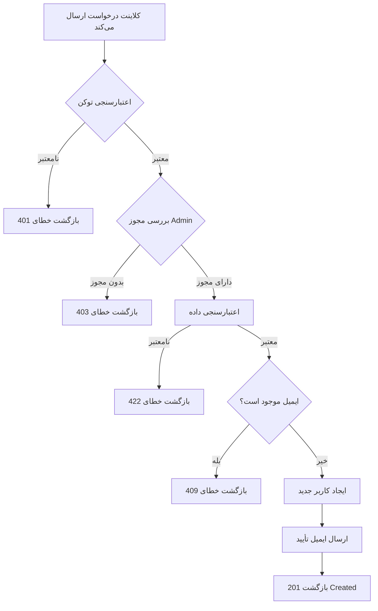

این سند ساختار استاندارد برای نوشتن مستندات در پروژه‌های بزرگ را توضیح می‌دهد. هدف اطمینان از یکپارچگی، قابلیت نگهداری و وضوح برای همه اعضای تیم است.

> [!NOTE]
> این سند در سراسر از **User Management API** به عنوان مثال توضیحی استفاده می‌کند. هنگام اعمال به پروژه خود، با دامنه/ماژول مربوطه جایگزین کنید.

<!--more-->

## نمای کلی

هر سند در پروژه باید از این ساختار پیروی کند:

1. **مقدمه** - نمای کلی ویژگی/ماژول
2. **منطق کسب‌وکار** - توضیح فرآیندهای کسب‌وکار
3. **منطق پیاده‌سازی** - جزئیات فنی پیاده‌سازی
4. **مرجع API** - مستندات کامل API (CRUD: Create, Read, Update, Delete)
5. **تست** - راهنمای تست
6. **عیب‌یابی** - حل مشکلات رایج

---

## 1. مقدمه

این بخش نمای کلی از ویژگی یا ماژول را ارائه می‌دهد.

### هدف

به طور خلاصه هدف این ویژگی در سیستم را توضیح دهید.

> **مثال (User Management):** ماژول User Management قابلیت‌های مدیریت کاربر در سیستم را فراهم می‌کند، شامل ایجاد، به‌روزرسانی، حذف و پرس‌وجوی اطلاعات کاربر.

### دامنه

- این ویژگی **چه کاری می‌تواند انجام دهد**
- این ویژگی **چه کاری نمی‌تواند انجام دهد**
- ماژول‌ها/سرویس‌های مرتبط

### پیش‌نیازها

| نیازمندی | نسخه | یادداشت |
| :------- | :--- | :------ |
| Node.js | >= 18.0 | الزامی |
| Redis | >= 7.0 | برای کش |
| PostgreSQL | >= 15 | پایگاه داده اصلی |

---

## 2. منطق کسب‌وکار

### فرآیند کسب‌وکار

جریان اصلی کسب‌وکار ویژگی را با نمودار توضیح دهید.

> **مثال (User Management):** جریان فرآیند ایجاد کاربر جدید:



### قوانین کسب‌وکار

| # | قانون | توضیحات |
| :- | :---- | :------ |
| 1 | احراز هویت الزامی | همه درخواست‌ها باید توکن معتبر داشته باشند |
| 2 | محدودیت نرخ | حداکثر 100 درخواست/دقیقه/کاربر |
| 3 | اعتبارسنجی | داده‌های ورودی باید از اعتبارسنجی عبور کنند |

### موارد خاص

- **مورد 1**: وقتی کاربر ایمیل را تأیید نکرده → فقط خواندن مجاز، عملیات نوشتن غیرمجاز
- **مورد 2**: وقتی سیستم بیش از حد بارگذاری شده → بازگشت 503 با هدر retry-after

---

## 3. منطق پیاده‌سازی

### معماری فنی

```
┌─────────────────┐     ┌─────────────────┐     ┌─────────────────┐
│   API Gateway   │────▶│   Auth Service  │────▶│   User Service  │
└─────────────────┘     └─────────────────┘     └─────────────────┘
         │                                               │
         │                                               ▼
         │                                      ┌─────────────────┐
         └─────────────────────────────────────▶│    Database     │
                                                └─────────────────┘
```

### جریان پردازش جزئی



### مرحله 1: دریافت درخواست

کلاینت درخواست را به API Gateway ارسال می‌کند. Gateway انجام می‌دهد:
- اعتبارسنجی فرمت درخواست
- استخراج توکن JWT از هدر
- ارسال به سرویس مربوطه

### مرحله 2: احراز هویت

Auth Service بررسی می‌کند:
- آیا توکن معتبر است؟
- آیا توکن منقضی شده؟
- آیا کاربر حق دسترسی دارد؟

### مرحله 3: پردازش منطق کسب‌وکار

سرویس منطق کسب‌وکار را پردازش می‌کند:
- اعتبارسنجی داده‌های ورودی
- اجرای منطق کسب‌وکار
- تعامل با پایگاه داده

### مرحله 4: بازگشت نتیجه

بسته‌بندی پاسخ و بازگشت به کلاینت با فرمت استاندارد.



### ساختار دایرکتوری


  
    
      
      
    
    
      
      
    
    
      
    
    
      
      
    
  


---

## 4. مرجع API

> [!NOTE]
> این بخش نحوه نوشتن مستندات کامل API با 5 endpoint پایه CRUD را نشان می‌دهد. مثال از **User Management API** استفاده می‌کند.

### نمای کلی Endpoint‌ها

| متد | Endpoint | توضیحات | مجوز |
| :-- | :------- | :------ | :--- |
| `GET` | `/api/v1/users` | لیست کاربران (با صفحه‌بندی) | Admin |
| `GET` | `/api/v1/users/{id}` | دریافت جزئیات کاربر | User/Admin |
| `POST` | `/api/v1/users` | ایجاد کاربر جدید | Admin |
| `PUT` | `/api/v1/users/{id}` | به‌روزرسانی اطلاعات کاربر | User/Admin |
| `DELETE` | `/api/v1/users/{id}` | حذف کاربر | Admin |

---

### 4.1 لیست کاربران

دریافت لیست کاربران با پشتیبانی از صفحه‌بندی، فیلتر و مرتب‌سازی.

#### اطلاعات پایه

| ویژگی | مقدار |
| :---- | :---- |
| **متد** | `GET` |
| **URL** | `/api/v1/users` |
| **احراز هویت** | Bearer Token (Admin) |

#### پارامترهای کوئری

| پارامتر | نوع | الزامی | توضیحات | پیش‌فرض |
| :------ | :-- | :----- | :------ | :------ |
| `page` | integer | ❌ | شماره صفحه (از 1 شروع می‌شود) | `1` |
| `limit` | integer | ❌ | تعداد رکورد در هر صفحه (حداکثر 100) | `20` |
| `sort` | string | ❌ | فیلد مرتب‌سازی: `createdAt`, `email`, `fullName` | `createdAt` |
| `order` | string | ❌ | ترتیب: `asc` یا `desc` | `desc` |
| `status` | string | ❌ | فیلتر بر اساس وضعیت: `active`, `pending_verification`, `suspended` | - |
| `role` | string | ❌ | فیلتر بر اساس نقش: `user`, `admin`, `moderator` | - |
| `search` | string | ❌ | جستجو بر اساس ایمیل یا نام | - |

#### هدرها

| هدر | نوع | الزامی | توضیحات |
| :-- | :-- | :----- | :------ |
| `Authorization` | string | ✅ | توکن احراز هویت. فرمت: `Bearer <token>` |
| `X-Request-ID` | string | ❌ | شناسه برای ردیابی درخواست |

#### cURL

```bash
curl --request GET \
  --url 'https://api.example.com/api/v1/users?page=1&limit=10&status=active&sort=createdAt&order=desc' \
  --header 'Authorization: Bearer <your_admin_token>'
```

#### پاسخ موفق

**کد وضعیت:** `200 OK`

```json
{
  "success": true,
  "data": [
    {
      "id": "usr_01HQ3K5XJPZ8VWMN4YGCR2BDEF",
      "email": "user1@example.com",
      "fullName": "علی محمدی",
      "role": "user",
      "status": "active",
      "createdAt": "2024-02-20T10:30:00.000Z"
    },
    {
      "id": "usr_01HQ3K5XJPZ8VWMN4YGCR2BGHI",
      "email": "user2@example.com",
      "fullName": "مریم احمدی",
      "role": "admin",
      "status": "active",
      "createdAt": "2024-02-19T08:00:00.000Z"
    }
  ],
  "pagination": {
    "page": 1,
    "limit": 10,
    "totalItems": 156,
    "totalPages": 16,
    "hasNextPage": true,
    "hasPrevPage": false
  },
  "meta": {
    "requestId": "req-345678",
    "timestamp": "2024-02-20T10:40:00.000Z"
  }
}
```

#### پاسخ‌های خطا




```json
{
  "success": false,
  "error": {
    "code": "UNAUTHORIZED",
    "message": "توکن نامعتبر یا منقضی شده است"
  },
  "meta": {
    "requestId": "req-345678",
    "timestamp": "2024-02-20T10:40:00.000Z"
  }
}
```



```json
{
  "success": false,
  "error": {
    "code": "FORBIDDEN",
    "message": "دسترسی رد شد",
    "details": "فقط Admin می‌تواند لیست کاربران را مشاهده کند"
  },
  "meta": {
    "requestId": "req-345678",
    "timestamp": "2024-02-20T10:40:00.000Z"
  }
}
```




---

### 4.2 دریافت جزئیات کاربر

دریافت اطلاعات جزئی یک کاربر با شناسه.

#### اطلاعات پایه

| ویژگی | مقدار |
| :---- | :---- |
| **متد** | `GET` |
| **URL** | `/api/v1/users/{id}` |
| **احراز هویت** | Bearer Token |

#### پارامترهای مسیر

| پارامتر | نوع | الزامی | توضیحات |
| :------ | :-- | :----- | :------ |
| `id` | string | ✅ | شناسه کاربر. فرمت: `usr_<ULID>` |

#### هدرها

| هدر | نوع | الزامی | توضیحات |
| :-- | :-- | :----- | :------ |
| `Authorization` | string | ✅ | توکن احراز هویت. فرمت: `Bearer <token>` |

#### cURL

```bash
curl --request GET \
  --url 'https://api.example.com/api/v1/users/usr_01HQ3K5XJPZ8VWMN4YGCR2BDEF' \
  --header 'Authorization: Bearer <your_token>'
```

#### پاسخ موفق

**کد وضعیت:** `200 OK`

```json
{
  "success": true,
  "data": {
    "id": "usr_01HQ3K5XJPZ8VWMN4YGCR2BDEF",
    "email": "user@example.com",
    "fullName": "علی محمدی",
    "phoneNumber": "+989121234567",
    "role": "user",
    "status": "active",
    "metadata": {
      "department": "Engineering",
      "employeeId": "EMP001"
    },
    "lastLoginAt": "2024-02-20T09:00:00.000Z",
    "createdAt": "2024-02-15T10:30:00.000Z",
    "updatedAt": "2024-02-20T09:00:00.000Z"
  },
  "meta": {
    "requestId": "req-789012",
    "timestamp": "2024-02-20T10:35:00.000Z"
  }
}
```

#### جزئیات ویژگی‌های پاسخ

| ویژگی | نوع | توضیحات |
| :---- | :-- | :------ |
| `id` | string | شناسه یکتای کاربر، فرمت ULID با پیشوند `usr_` |
| `email` | string | ایمیل ثبت شده |
| `fullName` | string | نام کامل |
| `phoneNumber` | string \| null | شماره تلفن (در صورت ارائه) |
| `role` | string | نقش: `user`, `admin`, `moderator` |
| `status` | string | وضعیت: `pending_verification`, `active`, `suspended`, `deleted` |
| `metadata` | object \| null | اطلاعات اضافی سفارشی |
| `lastLoginAt` | string \| null | زمان آخرین ورود (ISO 8601) |
| `createdAt` | string | زمان ایجاد (ISO 8601) |
| `updatedAt` | string | زمان آخرین به‌روزرسانی (ISO 8601) |

#### پاسخ‌های خطا




```json
{
  "success": false,
  "error": {
    "code": "UNAUTHORIZED",
    "message": "توکن نامعتبر یا منقضی شده است"
  },
  "meta": {
    "requestId": "req-789012",
    "timestamp": "2024-02-20T10:35:00.000Z"
  }
}
```



```json
{
  "success": false,
  "error": {
    "code": "FORBIDDEN",
    "message": "دسترسی به این منبع رد شده است",
    "details": "شما فقط می‌توانید اطلاعات خود را مشاهده کنید"
  },
  "meta": {
    "requestId": "req-789012",
    "timestamp": "2024-02-20T10:35:00.000Z"
  }
}
```



```json
{
  "success": false,
  "error": {
    "code": "NOT_FOUND",
    "message": "کاربر یافت نشد",
    "details": "کاربر با شناسه usr_01HQ3K5XJPZ8VWMN4YGCR2BDEF وجود ندارد"
  },
  "meta": {
    "requestId": "req-789012",
    "timestamp": "2024-02-20T10:35:00.000Z"
  }
}
```




---

### 4.3 ایجاد کاربر (Create)

ایجاد یک حساب کاربری جدید در سیستم.

#### اطلاعات پایه

| ویژگی | مقدار |
| :---- | :---- |
| **متد** | `POST` |
| **URL** | `/api/v1/users` |
| **احراز هویت** | Bearer Token (Admin) |
| **Content-Type** | `application/json` |

#### هدرها

| هدر | نوع | الزامی | توضیحات |
| :-- | :-- | :----- | :------ |
| `Authorization` | string | ✅ | توکن احراز هویت. فرمت: `Bearer <token>` |
| `Content-Type` | string | ✅ | باید `application/json` باشد |
| `X-Request-ID` | string | ❌ | شناسه برای ردیابی درخواست |

#### بدنه درخواست

```json
{
  "email": "newuser@example.com",
  "password": "SecureP@ss123",
  "fullName": "علی محمدی",
  "phoneNumber": "+989121234567",
  "role": "user",
  "metadata": {
    "department": "Engineering",
    "employeeId": "EMP001"
  }
}
```

#### جزئیات ویژگی‌های درخواست

| ویژگی | نوع | الزامی | توضیحات | محدودیت‌ها |
| :---- | :-- | :----- | :------ | :-------- |
| `email` | string | ✅ | آدرس ایمیل، به عنوان نام کاربری استفاده می‌شود | ایمیل معتبر، حداکثر 255 کاراکتر، یکتا |
| `password` | string | ✅ | رمز عبور ورود | حداقل 8 کاراکتر، باید شامل حروف بزرگ، کوچک، عدد و کاراکتر خاص باشد |
| `fullName` | string | ✅ | نام کامل | 2-100 کاراکتر |
| `phoneNumber` | string | ❌ | شماره تلفن | فرمت E.164 (مثال: +989121234567) |
| `role` | string | ❌ | نقش کاربر | `user` \| `admin` \| `moderator`. پیش‌فرض: `user` |
| `metadata` | object | ❌ | اطلاعات اضافی | آبجکت JSON، حداکثر 10KB |

#### cURL

```bash
curl --request POST \
  --url 'https://api.example.com/api/v1/users' \
  --header 'Authorization: Bearer <your_admin_token>' \
  --header 'Content-Type: application/json' \
  --data '{
    "email": "newuser@example.com",
    "password": "SecureP@ss123",
    "fullName": "علی محمدی",
    "phoneNumber": "+989121234567",
    "role": "user",
    "metadata": {
      "department": "Engineering",
      "employeeId": "EMP001"
    }
  }'
```

#### پاسخ موفق

**کد وضعیت:** `201 Created`

```json
{
  "success": true,
  "data": {
    "id": "usr_01HQ3K5XJPZ8VWMN4YGCR2BDEF",
    "email": "newuser@example.com",
    "fullName": "علی محمدی",
    "phoneNumber": "+989121234567",
    "role": "user",
    "status": "pending_verification",
    "metadata": {
      "department": "Engineering",
      "employeeId": "EMP001"
    },
    "createdAt": "2024-02-20T10:30:00.000Z",
    "updatedAt": "2024-02-20T10:30:00.000Z"
  },
  "meta": {
    "requestId": "req-123456",
    "timestamp": "2024-02-20T10:30:00.000Z"
  }
}
```

#### پاسخ‌های خطا




**علت:** بدنه درخواست فرمت JSON معتبر نیست.

```json
{
  "success": false,
  "error": {
    "code": "BAD_REQUEST",
    "message": "بدنه درخواست نامعتبر است",
    "details": "امکان تجزیه بدنه JSON وجود ندارد"
  },
  "meta": {
    "requestId": "req-123456",
    "timestamp": "2024-02-20T10:30:00.000Z"
  }
}
```



**علت:** توکن نامعتبر یا منقضی شده.

```json
{
  "success": false,
  "error": {
    "code": "UNAUTHORIZED",
    "message": "توکن نامعتبر یا منقضی شده است",
    "details": "لطفاً دوباره وارد شوید تا توکن جدید دریافت کنید"
  },
  "meta": {
    "requestId": "req-123456",
    "timestamp": "2024-02-20T10:30:00.000Z"
  }
}
```



**علت:** کاربر مجوز Admin ندارد.

```json
{
  "success": false,
  "error": {
    "code": "FORBIDDEN",
    "message": "مجوز انجام این عملیات را ندارید",
    "details": "فقط Admin می‌تواند کاربر جدید ایجاد کند"
  },
  "meta": {
    "requestId": "req-123456",
    "timestamp": "2024-02-20T10:30:00.000Z"
  }
}
```



**علت:** ایمیل قبلاً در سیستم وجود دارد.

```json
{
  "success": false,
  "error": {
    "code": "CONFLICT",
    "message": "ایمیل قبلاً استفاده شده است",
    "details": "ایمیل newuser@example.com قبلاً در سیستم وجود دارد"
  },
  "meta": {
    "requestId": "req-123456",
    "timestamp": "2024-02-20T10:30:00.000Z"
  }
}
```



**علت:** داده‌ها الزامات اعتبارسنجی را برآورده نمی‌کنند.

```json
{
  "success": false,
  "error": {
    "code": "VALIDATION_ERROR",
    "message": "داده‌ها نامعتبر هستند",
    "details": [
      {
        "field": "password",
        "message": "رمز عبور باید حداقل 8 کاراکتر باشد، شامل حروف بزرگ، کوچک، عدد و کاراکتر خاص"
      },
      {
        "field": "phoneNumber",
        "message": "شماره تلفن با فرمت E.164 مطابقت ندارد"
      }
    ]
  },
  "meta": {
    "requestId": "req-123456",
    "timestamp": "2024-02-20T10:30:00.000Z"
  }
}
```




---

### 4.4 به‌روزرسانی کاربر (Update)

به‌روزرسانی اطلاعات یک کاربر.

#### اطلاعات پایه

| ویژگی | مقدار |
| :---- | :---- |
| **متد** | `PUT` |
| **URL** | `/api/v1/users/{id}` |
| **احراز هویت** | Bearer Token |
| **Content-Type** | `application/json` |

#### پارامترهای مسیر

| پارامتر | نوع | الزامی | توضیحات |
| :------ | :-- | :----- | :------ |
| `id` | string | ✅ | شناسه کاربر برای به‌روزرسانی. فرمت: `usr_<ULID>` |

#### هدرها

| هدر | نوع | الزامی | توضیحات |
| :-- | :-- | :----- | :------ |
| `Authorization` | string | ✅ | توکن احراز هویت. فرمت: `Bearer <token>` |
| `Content-Type` | string | ✅ | باید `application/json` باشد |

#### بدنه درخواست

> [!NOTE]
> فقط فیلدهایی که می‌خواهید به‌روزرسانی کنید را ارسال کنید. فیلدهای ارسال نشده مقادیر فعلی خود را حفظ می‌کنند.

```json
{
  "fullName": "حسن رضایی",
  "phoneNumber": "+989129876543",
  "metadata": {
    "department": "Marketing",
    "employeeId": "EMP002"
  }
}
```

#### جزئیات ویژگی‌های درخواست

| ویژگی | نوع | الزامی | توضیحات | محدودیت‌ها |
| :---- | :-- | :----- | :------ | :-------- |
| `fullName` | string | ❌ | نام کامل جدید | 2-100 کاراکتر |
| `phoneNumber` | string | ❌ | شماره تلفن جدید | فرمت E.164 |
| `role` | string | ❌ | نقش جدید (فقط Admin) | `user` \| `admin` \| `moderator` |
| `status` | string | ❌ | وضعیت جدید (فقط Admin) | `active` \| `suspended` |
| `metadata` | object | ❌ | اطلاعات اضافی | آبجکت JSON، حداکثر 10KB |

> [!WARNING]
> فیلدهای `email` و `password` از طریق این endpoint قابل به‌روزرسانی نیستند. برای تغییر ایمیل/رمز عبور از endpoint‌های جداگانه استفاده کنید.

#### cURL

```bash
curl --request PUT \
  --url 'https://api.example.com/api/v1/users/usr_01HQ3K5XJPZ8VWMN4YGCR2BDEF' \
  --header 'Authorization: Bearer <your_token>' \
  --header 'Content-Type: application/json' \
  --data '{
    "fullName": "حسن رضایی",
    "phoneNumber": "+989129876543",
    "metadata": {
      "department": "Marketing",
      "employeeId": "EMP002"
    }
  }'
```

#### پاسخ موفق

**کد وضعیت:** `200 OK`

```json
{
  "success": true,
  "data": {
    "id": "usr_01HQ3K5XJPZ8VWMN4YGCR2BDEF",
    "email": "user@example.com",
    "fullName": "حسن رضایی",
    "phoneNumber": "+989129876543",
    "role": "user",
    "status": "active",
    "metadata": {
      "department": "Marketing",
      "employeeId": "EMP002"
    },
    "createdAt": "2024-02-15T10:30:00.000Z",
    "updatedAt": "2024-02-20T14:00:00.000Z"
  },
  "meta": {
    "requestId": "req-456789",
    "timestamp": "2024-02-20T14:00:00.000Z"
  }
}
```

#### پاسخ‌های خطا




```json
{
  "success": false,
  "error": {
    "code": "UNAUTHORIZED",
    "message": "توکن نامعتبر یا منقضی شده است"
  },
  "meta": {
    "requestId": "req-456789",
    "timestamp": "2024-02-20T14:00:00.000Z"
  }
}
```



**علت:** کاربر مجوز به‌روزرسانی کاربر دیگر را ندارد، یا هنگام به‌روزرسانی role/status، Admin نیست.

```json
{
  "success": false,
  "error": {
    "code": "FORBIDDEN",
    "message": "مجوز به‌روزرسانی این منبع را ندارید",
    "details": "شما فقط می‌توانید اطلاعات خود را به‌روزرسانی کنید"
  },
  "meta": {
    "requestId": "req-456789",
    "timestamp": "2024-02-20T14:00:00.000Z"
  }
}
```



```json
{
  "success": false,
  "error": {
    "code": "NOT_FOUND",
    "message": "کاربر یافت نشد",
    "details": "کاربر با شناسه usr_01HQ3K5XJPZ8VWMN4YGCR2BDEF وجود ندارد"
  },
  "meta": {
    "requestId": "req-456789",
    "timestamp": "2024-02-20T14:00:00.000Z"
  }
}
```



```json
{
  "success": false,
  "error": {
    "code": "VALIDATION_ERROR",
    "message": "داده‌ها نامعتبر هستند",
    "details": [
      {
        "field": "phoneNumber",
        "message": "شماره تلفن با فرمت E.164 مطابقت ندارد"
      }
    ]
  },
  "meta": {
    "requestId": "req-456789",
    "timestamp": "2024-02-20T14:00:00.000Z"
  }
}
```




---

### 4.5 حذف کاربر (Delete)

حذف یک کاربر از سیستم.

#### اطلاعات پایه

| ویژگی | مقدار |
| :---- | :---- |
| **متد** | `DELETE` |
| **URL** | `/api/v1/users/{id}` |
| **احراز هویت** | Bearer Token (Admin) |

#### پارامترهای مسیر

| پارامتر | نوع | الزامی | توضیحات |
| :------ | :-- | :----- | :------ |
| `id` | string | ✅ | شناسه کاربر برای حذف. فرمت: `usr_<ULID>` |

#### هدرها

| هدر | نوع | الزامی | توضیحات |
| :-- | :-- | :----- | :------ |
| `Authorization` | string | ✅ | توکن احراز هویت. فرمت: `Bearer <token>` |

#### پارامترهای کوئری (اختیاری)

| پارامتر | نوع | الزامی | توضیحات | پیش‌فرض |
| :------ | :-- | :----- | :------ | :------ |
| `hard` | boolean | ❌ | `true` = حذف دائمی، `false` = حذف نرم | `false` |

> [!WARNING]
> وقتی `hard=true`، داده‌ها به طور دائمی حذف می‌شوند و قابل بازیابی نیستند. پیش‌فرض از حذف نرم (تغییر وضعیت به `deleted`) استفاده می‌کند.

#### cURL

```bash
# حذف نرم (پیش‌فرض)
curl --request DELETE \
  --url 'https://api.example.com/api/v1/users/usr_01HQ3K5XJPZ8VWMN4YGCR2BDEF' \
  --header 'Authorization: Bearer <your_admin_token>'

# حذف سخت (دائمی)
curl --request DELETE \
  --url 'https://api.example.com/api/v1/users/usr_01HQ3K5XJPZ8VWMN4YGCR2BDEF?hard=true' \
  --header 'Authorization: Bearer <your_admin_token>'
```

#### پاسخ موفق

**کد وضعیت:** `200 OK`

```json
{
  "success": true,
  "data": {
    "id": "usr_01HQ3K5XJPZ8VWMN4YGCR2BDEF",
    "deleted": true,
    "deletedAt": "2024-02-20T15:00:00.000Z",
    "hardDelete": false
  },
  "meta": {
    "requestId": "req-567890",
    "timestamp": "2024-02-20T15:00:00.000Z"
  }
}
```

#### پاسخ‌های خطا




```json
{
  "success": false,
  "error": {
    "code": "UNAUTHORIZED",
    "message": "توکن نامعتبر یا منقضی شده است"
  },
  "meta": {
    "requestId": "req-567890",
    "timestamp": "2024-02-20T15:00:00.000Z"
  }
}
```



```json
{
  "success": false,
  "error": {
    "code": "FORBIDDEN",
    "message": "مجوز حذف کاربر را ندارید",
    "details": "فقط Admin می‌تواند کاربران را حذف کند"
  },
  "meta": {
    "requestId": "req-567890",
    "timestamp": "2024-02-20T15:00:00.000Z"
  }
}
```



```json
{
  "success": false,
  "error": {
    "code": "NOT_FOUND",
    "message": "کاربر یافت نشد",
    "details": "کاربر با شناسه usr_01HQ3K5XJPZ8VWMN4YGCR2BDEF وجود ندارد"
  },
  "meta": {
    "requestId": "req-567890",
    "timestamp": "2024-02-20T15:00:00.000Z"
  }
}
```



**علت:** به دلیل محدودیت‌های داده امکان حذف کاربر وجود ندارد.

```json
{
  "success": false,
  "error": {
    "code": "CONFLICT",
    "message": "امکان حذف کاربر وجود ندارد",
    "details": "این کاربر داده‌های مرتبط دارد. لطفاً ابتدا داده‌ها را حذف یا انتقال دهید."
  },
  "meta": {
    "requestId": "req-567890",
    "timestamp": "2024-02-20T15:00:00.000Z"
  }
}
```




---

## 5. تست

### تست‌های واحد

فایل‌های تست برای ماژول:


  
    
      
      
    
    
      
    
    
      
    
  


### اجرای تست‌ها

```bash
# اجرای همه تست‌های واحد
npm run test:unit

# اجرای تست‌های یکپارچگی
npm run test:integration

# اجرای تست‌های e2e
npm run test:e2e

# اجرای تست‌ها با پوشش
npm run test:coverage
```

### موارد تست مهم

| مورد تست | توضیحات | نتیجه مورد انتظار |
| :------- | :------ | :--------------- |
| TC-001 | GET /users - لیست با صفحه‌بندی | وضعیت 200، تعداد رکورد صحیح |
| TC-002 | GET /users/:id - دریافت کاربر موجود | وضعیت 200، اطلاعات کاربر |
| TC-003 | GET /users/:id - دریافت کاربر ناموجود | وضعیت 404، خطای NOT_FOUND |
| TC-004 | POST /users - ایجاد با داده‌های معتبر | وضعیت 201، کاربر ایجاد شد |
| TC-005 | POST /users - ایجاد با ایمیل تکراری | وضعیت 409، خطای CONFLICT |
| TC-006 | POST /users - ایجاد با رمز عبور ضعیف | وضعیت 422، خطای اعتبارسنجی |
| TC-007 | PUT /users/:id - به‌روزرسانی موفق | وضعیت 200، داده‌ها به‌روز شد |
| TC-008 | PUT /users/:id - به‌روزرسانی کاربر دیگر (غیر Admin) | وضعیت 403، خطای FORBIDDEN |
| TC-009 | DELETE /users/:id - حذف نرم | وضعیت 200، وضعیت به deleted تغییر کرد |
| TC-010 | DELETE /users/:id - حذف سخت | وضعیت 200، رکورد از DB حذف شد |
| TC-011 | دسترسی بدون توکن | وضعیت 401، خطای UNAUTHORIZED |

---

## 6. عیب‌یابی

### خطاهای رایج


**خطا: "توکن نامعتبر است" (401)**

**علل احتمالی:**
- توکن منقضی شده است
- فرمت توکن نادرست است
- کلید مخفی مطابقت ندارد

**راه‌حل:**
1. بررسی کنید توکن فرمت صحیح `Bearer <token>` دارد
2. توکن را رمزگشایی کنید تا زمان انقضا را بررسی کنید
3. دوباره وارد شوید تا توکن جدید دریافت کنید



**خطا: "محدودیت نرخ بیش از حد" (429)**

**علت:** بیش از محدودیت 100 درخواست/دقیقه

**راه‌حل:**
1. هدر `Retry-After` را برای زمان انتظار بررسی کنید
2. پس‌رفت نمایی را در کلاینت پیاده‌سازی کنید
3. در صورت نیاز به افزایش محدودیت با مدیر تماس بگیرید



**خطا: "خطای اعتبارسنجی" (422)**

**علت:** داده‌های ارسال شده با فرمت یا محدودیت‌ها مطابقت ندارند

**راه‌حل:**
1. `details` در پاسخ را با دقت بخوانید تا بفهمید کدام فیلد خطا دارد
2. محدودیت‌های فیلد را در مستندات بررسی کنید
3. داده‌ها را اصلاح کنید و درخواست را دوباره ارسال کنید


### تماس با پشتیبانی

اگر با مشکلاتی مواجه شدید که نمی‌توانید حل کنید:

- **ایمیل:** support@example.com
- **Slack:** #api-support
- **مستندات:** https://docs.example.com

---

## 7. تاریخچه تغییرات

| نسخه | تاریخ | تغییرات |
| :--- | :---- | :------ |
| v1.3.0 | 2024-02-20 | افزودن endpoint DELETE با حذف نرم/سخت |
| v1.2.0 | 2024-02-15 | افزودن endpoint PUT برای به‌روزرسانی کاربر |
| v1.1.0 | 2024-02-01 | افزودن API صفحه‌بندی، فیلتر و جستجو |
| v1.0.0 | 2024-01-15 | انتشار اولیه با GET و POST |

---

## مستندات مرتبط


  
  
  

