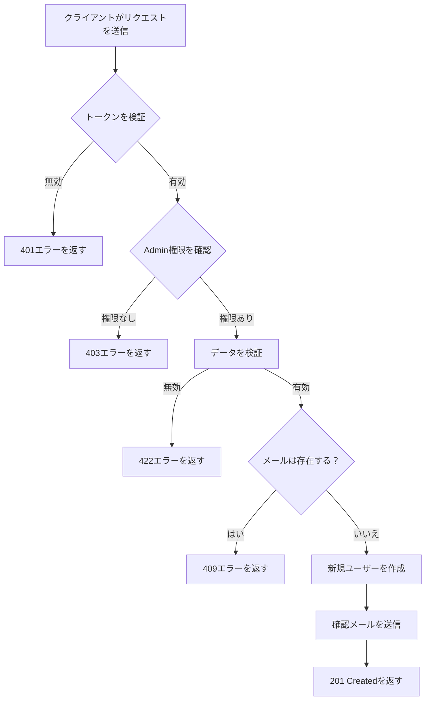

このドキュメントは、大規模プロジェクトにおけるドキュメント作成の標準構造を説明します。目標は、チームメンバー全員にとっての一貫性、保守性、明確性を確保することです。

> [!NOTE]
> このドキュメント全体では、**User Management API** を例として使用しています。プロジェクトに適用する際は、対応するドメイン/モジュールに置き換えてください。

<!--more-->

## 概要

プロジェクト内の各ドキュメントは、以下の構造に従う必要があります：

1. **はじめに** - 機能/モジュールの概要
2. **ビジネスロジック** - ビジネスプロセスの説明
3. **実装ロジック** - 技術的な実装の詳細
4. **APIリファレンス** - 完全なAPIドキュメント（CRUD: Create, Read, Update, Delete）
5. **テスト** - テストガイドライン
6. **トラブルシューティング** - 一般的な問題の解決

---

## 1. はじめに

このセクションでは、機能またはモジュールの概要を提供します。

### 目的

システムにおけるこの機能の目的を簡潔に説明します。

> **例（User Management）:** User Managementモジュールは、ユーザーの作成、更新、削除、情報照会など、システム内のユーザー管理機能を提供します。

### 範囲

- この機能で**できること**
- この機能で**できないこと**
- 関連するモジュール/サービス

### 前提条件

| 要件 | バージョン | 備考 |
| :--- | :-------- | :--- |
| Node.js | >= 18.0 | 必須 |
| Redis | >= 7.0 | キャッシュ用 |
| PostgreSQL | >= 15 | メインデータベース |

---

## 2. ビジネスロジック

### ビジネスプロセス

機能のメインビジネスフローを図で説明します。

> **例（User Management）:** 新規ユーザー作成のプロセスフロー：



### ビジネスルール

| # | ルール | 説明 |
| :- | :---- | :--- |
| 1 | 認証必須 | すべてのリクエストには有効なトークンが必要 |
| 2 | レート制限 | ユーザーあたり最大100リクエスト/分 |
| 3 | バリデーション | 入力データはバリデーションを通過する必要がある |

### 特殊なケース

- **ケース1**: ユーザーがメール未確認の場合 → 読み取りのみ許可、書き込み操作は不可
- **ケース2**: システムが過負荷の場合 → 503とretry-afterヘッダーを返す

---

## 3. 実装ロジック

### 技術アーキテクチャ

```
┌─────────────────┐     ┌─────────────────┐     ┌─────────────────┐
│   API Gateway   │────▶│   Auth Service  │────▶│   User Service  │
└─────────────────┘     └─────────────────┘     └─────────────────┘
         │                                               │
         │                                               ▼
         │                                      ┌─────────────────┐
         └─────────────────────────────────────▶│    Database     │
                                                └─────────────────┘
```

### 詳細な処理フロー



### ステップ1: リクエストの受信

クライアントがAPI Gatewayにリクエストを送信。Gatewayは以下を実行：
- リクエストフォーマットの検証
- ヘッダーからJWTトークンを抽出
- 対応するサービスに転送

### ステップ2: 認証

Auth Serviceが確認：
- トークンは有効か？
- トークンは期限切れか？
- ユーザーにアクセス権があるか？

### ステップ3: ビジネスロジックの処理

サービスがビジネスロジックを処理：
- 入力データの検証
- ビジネスロジックの実行
- データベースとの連携

### ステップ4: 結果の返却

レスポンスをパッケージ化し、標準フォーマットでクライアントに返す。



### ディレクトリ構造


  
    
      
      
    
    
      
      
    
    
      
    
    
      
      
    
  


---

## 4. APIリファレンス

> [!NOTE]
> このセクションでは、5つの基本的なCRUDエンドポイントを使用した完全なAPIドキュメントの書き方を示します。例として**User Management API**を使用しています。

### エンドポイント概要

| メソッド | エンドポイント | 説明 | 権限 |
| :------ | :----------- | :--- | :--- |
| `GET` | `/api/v1/users` | ユーザー一覧（ページネーション付き） | Admin |
| `GET` | `/api/v1/users/{id}` | ユーザー詳細情報 | User/Admin |
| `POST` | `/api/v1/users` | 新規ユーザー作成 | Admin |
| `PUT` | `/api/v1/users/{id}` | ユーザー情報更新 | User/Admin |
| `DELETE` | `/api/v1/users/{id}` | ユーザー削除 | Admin |

---

### 4.1 ユーザー一覧

ページネーション、フィルタリング、ソートをサポートしたユーザー一覧を取得します。

#### 基本情報

| プロパティ | 値 |
| :-------- | :- |
| **メソッド** | `GET` |
| **URL** | `/api/v1/users` |
| **認証** | Bearer Token (Admin) |

#### クエリパラメータ

| パラメータ | 型 | 必須 | 説明 | デフォルト |
| :-------- | :- | :-- | :--- | :------- |
| `page` | integer | ❌ | ページ番号（1から開始） | `1` |
| `limit` | integer | ❌ | ページあたりのレコード数（最大100） | `20` |
| `sort` | string | ❌ | ソートフィールド: `createdAt`, `email`, `fullName` | `createdAt` |
| `order` | string | ❌ | 順序: `asc` または `desc` | `desc` |
| `status` | string | ❌ | ステータスでフィルタ: `active`, `pending_verification`, `suspended` | - |
| `role` | string | ❌ | ロールでフィルタ: `user`, `admin`, `moderator` | - |
| `search` | string | ❌ | メールまたは名前で検索 | - |

#### ヘッダー

| ヘッダー | 型 | 必須 | 説明 |
| :------ | :- | :-- | :--- |
| `Authorization` | string | ✅ | 認証トークン。フォーマット: `Bearer <token>` |
| `X-Request-ID` | string | ❌ | リクエスト追跡用ID |

#### cURL

```bash
curl --request GET \
  --url 'https://api.example.com/api/v1/users?page=1&limit=10&status=active&sort=createdAt&order=desc' \
  --header 'Authorization: Bearer <your_admin_token>'
```

#### 成功レスポンス

**ステータスコード:** `200 OK`

```json
{
  "success": true,
  "data": [
    {
      "id": "usr_01HQ3K5XJPZ8VWMN4YGCR2BDEF",
      "email": "user1@example.com",
      "fullName": "山田太郎",
      "role": "user",
      "status": "active",
      "createdAt": "2024-02-20T10:30:00.000Z"
    },
    {
      "id": "usr_01HQ3K5XJPZ8VWMN4YGCR2BGHI",
      "email": "user2@example.com",
      "fullName": "鈴木花子",
      "role": "admin",
      "status": "active",
      "createdAt": "2024-02-19T08:00:00.000Z"
    }
  ],
  "pagination": {
    "page": 1,
    "limit": 10,
    "totalItems": 156,
    "totalPages": 16,
    "hasNextPage": true,
    "hasPrevPage": false
  },
  "meta": {
    "requestId": "req-345678",
    "timestamp": "2024-02-20T10:40:00.000Z"
  }
}
```

#### エラーレスポンス




```json
{
  "success": false,
  "error": {
    "code": "UNAUTHORIZED",
    "message": "トークンが無効または期限切れです"
  },
  "meta": {
    "requestId": "req-345678",
    "timestamp": "2024-02-20T10:40:00.000Z"
  }
}
```



```json
{
  "success": false,
  "error": {
    "code": "FORBIDDEN",
    "message": "アクセスが拒否されました",
    "details": "Adminのみがユーザー一覧を閲覧できます"
  },
  "meta": {
    "requestId": "req-345678",
    "timestamp": "2024-02-20T10:40:00.000Z"
  }
}
```




---

### 4.2 ユーザー詳細情報

IDでユーザーの詳細情報を取得します。

#### 基本情報

| プロパティ | 値 |
| :-------- | :- |
| **メソッド** | `GET` |
| **URL** | `/api/v1/users/{id}` |
| **認証** | Bearer Token |

#### パスパラメータ

| パラメータ | 型 | 必須 | 説明 |
| :-------- | :- | :-- | :--- |
| `id` | string | ✅ | ユーザーID。フォーマット: `usr_<ULID>` |

#### ヘッダー

| ヘッダー | 型 | 必須 | 説明 |
| :------ | :- | :-- | :--- |
| `Authorization` | string | ✅ | 認証トークン。フォーマット: `Bearer <token>` |

#### cURL

```bash
curl --request GET \
  --url 'https://api.example.com/api/v1/users/usr_01HQ3K5XJPZ8VWMN4YGCR2BDEF' \
  --header 'Authorization: Bearer <your_token>'
```

#### 成功レスポンス

**ステータスコード:** `200 OK`

```json
{
  "success": true,
  "data": {
    "id": "usr_01HQ3K5XJPZ8VWMN4YGCR2BDEF",
    "email": "user@example.com",
    "fullName": "山田太郎",
    "phoneNumber": "+819012345678",
    "role": "user",
    "status": "active",
    "metadata": {
      "department": "Engineering",
      "employeeId": "EMP001"
    },
    "lastLoginAt": "2024-02-20T09:00:00.000Z",
    "createdAt": "2024-02-15T10:30:00.000Z",
    "updatedAt": "2024-02-20T09:00:00.000Z"
  },
  "meta": {
    "requestId": "req-789012",
    "timestamp": "2024-02-20T10:35:00.000Z"
  }
}
```

#### レスポンスプロパティの詳細

| プロパティ | 型 | 説明 |
| :-------- | :- | :--- |
| `id` | string | 一意のユーザーID、`usr_`プレフィックス付きULIDフォーマット |
| `email` | string | 登録されたメール |
| `fullName` | string | フルネーム |
| `phoneNumber` | string \| null | 電話番号（指定された場合） |
| `role` | string | ロール: `user`, `admin`, `moderator` |
| `status` | string | ステータス: `pending_verification`, `active`, `suspended`, `deleted` |
| `metadata` | object \| null | カスタム追加情報 |
| `lastLoginAt` | string \| null | 最終ログインタイムスタンプ（ISO 8601） |
| `createdAt` | string | 作成タイムスタンプ（ISO 8601） |
| `updatedAt` | string | 最終更新タイムスタンプ（ISO 8601） |

#### エラーレスポンス




```json
{
  "success": false,
  "error": {
    "code": "UNAUTHORIZED",
    "message": "トークンが無効または期限切れです"
  },
  "meta": {
    "requestId": "req-789012",
    "timestamp": "2024-02-20T10:35:00.000Z"
  }
}
```



```json
{
  "success": false,
  "error": {
    "code": "FORBIDDEN",
    "message": "このリソースへのアクセスは拒否されました",
    "details": "自分の情報のみ閲覧できます"
  },
  "meta": {
    "requestId": "req-789012",
    "timestamp": "2024-02-20T10:35:00.000Z"
  }
}
```



```json
{
  "success": false,
  "error": {
    "code": "NOT_FOUND",
    "message": "ユーザーが見つかりません",
    "details": "ID usr_01HQ3K5XJPZ8VWMN4YGCR2BDEF のユーザーは存在しません"
  },
  "meta": {
    "requestId": "req-789012",
    "timestamp": "2024-02-20T10:35:00.000Z"
  }
}
```




---

### 4.3 新規ユーザー作成（Create）

システムに新しいユーザーアカウントを作成します。

#### 基本情報

| プロパティ | 値 |
| :-------- | :- |
| **メソッド** | `POST` |
| **URL** | `/api/v1/users` |
| **認証** | Bearer Token (Admin) |
| **Content-Type** | `application/json` |

#### ヘッダー

| ヘッダー | 型 | 必須 | 説明 |
| :------ | :- | :-- | :--- |
| `Authorization` | string | ✅ | 認証トークン。フォーマット: `Bearer <token>` |
| `Content-Type` | string | ✅ | `application/json`である必要があります |
| `X-Request-ID` | string | ❌ | リクエスト追跡用ID |

#### リクエストボディ

```json
{
  "email": "newuser@example.com",
  "password": "SecureP@ss123",
  "fullName": "山田太郎",
  "phoneNumber": "+819012345678",
  "role": "user",
  "metadata": {
    "department": "Engineering",
    "employeeId": "EMP001"
  }
}
```

#### リクエストプロパティの詳細

| プロパティ | 型 | 必須 | 説明 | 制約 |
| :-------- | :- | :-- | :--- | :--- |
| `email` | string | ✅ | メールアドレス、ユーザー名として使用 | 有効なメール、最大255文字、一意 |
| `password` | string | ✅ | ログインパスワード | 最小8文字、大文字、小文字、数字、特殊文字を含む必要あり |
| `fullName` | string | ✅ | フルネーム | 2-100文字 |
| `phoneNumber` | string | ❌ | 電話番号 | E.164フォーマット（例: +819012345678） |
| `role` | string | ❌ | ユーザーロール | `user` \| `admin` \| `moderator`。デフォルト: `user` |
| `metadata` | object | ❌ | 追加情報 | JSONオブジェクト、最大10KB |

#### cURL

```bash
curl --request POST \
  --url 'https://api.example.com/api/v1/users' \
  --header 'Authorization: Bearer <your_admin_token>' \
  --header 'Content-Type: application/json' \
  --data '{
    "email": "newuser@example.com",
    "password": "SecureP@ss123",
    "fullName": "山田太郎",
    "phoneNumber": "+819012345678",
    "role": "user",
    "metadata": {
      "department": "Engineering",
      "employeeId": "EMP001"
    }
  }'
```

#### 成功レスポンス

**ステータスコード:** `201 Created`

```json
{
  "success": true,
  "data": {
    "id": "usr_01HQ3K5XJPZ8VWMN4YGCR2BDEF",
    "email": "newuser@example.com",
    "fullName": "山田太郎",
    "phoneNumber": "+819012345678",
    "role": "user",
    "status": "pending_verification",
    "metadata": {
      "department": "Engineering",
      "employeeId": "EMP001"
    },
    "createdAt": "2024-02-20T10:30:00.000Z",
    "updatedAt": "2024-02-20T10:30:00.000Z"
  },
  "meta": {
    "requestId": "req-123456",
    "timestamp": "2024-02-20T10:30:00.000Z"
  }
}
```

#### エラーレスポンス




**原因:** リクエストボディが有効なJSONフォーマットでない。

```json
{
  "success": false,
  "error": {
    "code": "BAD_REQUEST",
    "message": "リクエストボディが無効です",
    "details": "JSONボディを解析できません"
  },
  "meta": {
    "requestId": "req-123456",
    "timestamp": "2024-02-20T10:30:00.000Z"
  }
}
```



**原因:** トークンが無効または期限切れ。

```json
{
  "success": false,
  "error": {
    "code": "UNAUTHORIZED",
    "message": "トークンが無効または期限切れです",
    "details": "新しいトークンを取得するために再度ログインしてください"
  },
  "meta": {
    "requestId": "req-123456",
    "timestamp": "2024-02-20T10:30:00.000Z"
  }
}
```



**原因:** ユーザーにAdmin権限がない。

```json
{
  "success": false,
  "error": {
    "code": "FORBIDDEN",
    "message": "この操作を実行する権限がありません",
    "details": "Adminのみが新規ユーザーを作成できます"
  },
  "meta": {
    "requestId": "req-123456",
    "timestamp": "2024-02-20T10:30:00.000Z"
  }
}
```



**原因:** メールがシステムに既に存在する。

```json
{
  "success": false,
  "error": {
    "code": "CONFLICT",
    "message": "メールは既に使用されています",
    "details": "メール newuser@example.com はシステムに既に存在します"
  },
  "meta": {
    "requestId": "req-123456",
    "timestamp": "2024-02-20T10:30:00.000Z"
  }
}
```



**原因:** データがバリデーション要件を満たしていない。

```json
{
  "success": false,
  "error": {
    "code": "VALIDATION_ERROR",
    "message": "データが無効です",
    "details": [
      {
        "field": "password",
        "message": "パスワードは大文字、小文字、数字、特殊文字を含む8文字以上である必要があります"
      },
      {
        "field": "phoneNumber",
        "message": "電話番号がE.164フォーマットと一致しません"
      }
    ]
  },
  "meta": {
    "requestId": "req-123456",
    "timestamp": "2024-02-20T10:30:00.000Z"
  }
}
```




---

### 4.4 ユーザー更新（Update）

ユーザーの情報を更新します。

#### 基本情報

| プロパティ | 値 |
| :-------- | :- |
| **メソッド** | `PUT` |
| **URL** | `/api/v1/users/{id}` |
| **認証** | Bearer Token |
| **Content-Type** | `application/json` |

#### パスパラメータ

| パラメータ | 型 | 必須 | 説明 |
| :-------- | :- | :-- | :--- |
| `id` | string | ✅ | 更新するユーザーID。フォーマット: `usr_<ULID>` |

#### ヘッダー

| ヘッダー | 型 | 必須 | 説明 |
| :------ | :- | :-- | :--- |
| `Authorization` | string | ✅ | 認証トークン。フォーマット: `Bearer <token>` |
| `Content-Type` | string | ✅ | `application/json`である必要があります |

#### リクエストボディ

> [!NOTE]
> 更新したいフィールドのみを送信してください。送信されないフィールドは現在の値を保持します。

```json
{
  "fullName": "田中次郎",
  "phoneNumber": "+819087654321",
  "metadata": {
    "department": "Marketing",
    "employeeId": "EMP002"
  }
}
```

#### リクエストプロパティの詳細

| プロパティ | 型 | 必須 | 説明 | 制約 |
| :-------- | :- | :-- | :--- | :--- |
| `fullName` | string | ❌ | 新しいフルネーム | 2-100文字 |
| `phoneNumber` | string | ❌ | 新しい電話番号 | E.164フォーマット |
| `role` | string | ❌ | 新しいロール（Adminのみ） | `user` \| `admin` \| `moderator` |
| `status` | string | ❌ | 新しいステータス（Adminのみ） | `active` \| `suspended` |
| `metadata` | object | ❌ | 追加情報 | JSONオブジェクト、最大10KB |

> [!WARNING]
> `email`と`password`フィールドはこのエンドポイントでは更新できません。メール/パスワードの変更には専用のエンドポイントを使用してください。

#### cURL

```bash
curl --request PUT \
  --url 'https://api.example.com/api/v1/users/usr_01HQ3K5XJPZ8VWMN4YGCR2BDEF' \
  --header 'Authorization: Bearer <your_token>' \
  --header 'Content-Type: application/json' \
  --data '{
    "fullName": "田中次郎",
    "phoneNumber": "+819087654321",
    "metadata": {
      "department": "Marketing",
      "employeeId": "EMP002"
    }
  }'
```

#### 成功レスポンス

**ステータスコード:** `200 OK`

```json
{
  "success": true,
  "data": {
    "id": "usr_01HQ3K5XJPZ8VWMN4YGCR2BDEF",
    "email": "user@example.com",
    "fullName": "田中次郎",
    "phoneNumber": "+819087654321",
    "role": "user",
    "status": "active",
    "metadata": {
      "department": "Marketing",
      "employeeId": "EMP002"
    },
    "createdAt": "2024-02-15T10:30:00.000Z",
    "updatedAt": "2024-02-20T14:00:00.000Z"
  },
  "meta": {
    "requestId": "req-456789",
    "timestamp": "2024-02-20T14:00:00.000Z"
  }
}
```

#### エラーレスポンス




```json
{
  "success": false,
  "error": {
    "code": "UNAUTHORIZED",
    "message": "トークンが無効または期限切れです"
  },
  "meta": {
    "requestId": "req-456789",
    "timestamp": "2024-02-20T14:00:00.000Z"
  }
}
```



**原因:** ユーザーに他のユーザーを更新する権限がない、またはrole/status更新時にAdminでない。

```json
{
  "success": false,
  "error": {
    "code": "FORBIDDEN",
    "message": "このリソースを更新する権限がありません",
    "details": "自分の情報のみ更新できます"
  },
  "meta": {
    "requestId": "req-456789",
    "timestamp": "2024-02-20T14:00:00.000Z"
  }
}
```



```json
{
  "success": false,
  "error": {
    "code": "NOT_FOUND",
    "message": "ユーザーが見つかりません",
    "details": "ID usr_01HQ3K5XJPZ8VWMN4YGCR2BDEF のユーザーは存在しません"
  },
  "meta": {
    "requestId": "req-456789",
    "timestamp": "2024-02-20T14:00:00.000Z"
  }
}
```



```json
{
  "success": false,
  "error": {
    "code": "VALIDATION_ERROR",
    "message": "データが無効です",
    "details": [
      {
        "field": "phoneNumber",
        "message": "電話番号がE.164フォーマットと一致しません"
      }
    ]
  },
  "meta": {
    "requestId": "req-456789",
    "timestamp": "2024-02-20T14:00:00.000Z"
  }
}
```




---

### 4.5 ユーザー削除（Delete）

システムからユーザーを削除します。

#### 基本情報

| プロパティ | 値 |
| :-------- | :- |
| **メソッド** | `DELETE` |
| **URL** | `/api/v1/users/{id}` |
| **認証** | Bearer Token (Admin) |

#### パスパラメータ

| パラメータ | 型 | 必須 | 説明 |
| :-------- | :- | :-- | :--- |
| `id` | string | ✅ | 削除するユーザーID。フォーマット: `usr_<ULID>` |

#### ヘッダー

| ヘッダー | 型 | 必須 | 説明 |
| :------ | :- | :-- | :--- |
| `Authorization` | string | ✅ | 認証トークン。フォーマット: `Bearer <token>` |

#### クエリパラメータ（オプション）

| パラメータ | 型 | 必須 | 説明 | デフォルト |
| :-------- | :- | :-- | :--- | :------- |
| `hard` | boolean | ❌ | `true` = 完全削除、`false` = ソフト削除 | `false` |

> [!WARNING]
> `hard=true`の場合、データは完全に削除され、復元できません。デフォルトではソフト削除（ステータスを`deleted`に変更）を使用します。

#### cURL

```bash
# ソフト削除（デフォルト）
curl --request DELETE \
  --url 'https://api.example.com/api/v1/users/usr_01HQ3K5XJPZ8VWMN4YGCR2BDEF' \
  --header 'Authorization: Bearer <your_admin_token>'

# ハード削除（完全削除）
curl --request DELETE \
  --url 'https://api.example.com/api/v1/users/usr_01HQ3K5XJPZ8VWMN4YGCR2BDEF?hard=true' \
  --header 'Authorization: Bearer <your_admin_token>'
```

#### 成功レスポンス

**ステータスコード:** `200 OK`

```json
{
  "success": true,
  "data": {
    "id": "usr_01HQ3K5XJPZ8VWMN4YGCR2BDEF",
    "deleted": true,
    "deletedAt": "2024-02-20T15:00:00.000Z",
    "hardDelete": false
  },
  "meta": {
    "requestId": "req-567890",
    "timestamp": "2024-02-20T15:00:00.000Z"
  }
}
```

#### エラーレスポンス




```json
{
  "success": false,
  "error": {
    "code": "UNAUTHORIZED",
    "message": "トークンが無効または期限切れです"
  },
  "meta": {
    "requestId": "req-567890",
    "timestamp": "2024-02-20T15:00:00.000Z"
  }
}
```



```json
{
  "success": false,
  "error": {
    "code": "FORBIDDEN",
    "message": "ユーザーを削除する権限がありません",
    "details": "Adminのみがユーザーを削除できます"
  },
  "meta": {
    "requestId": "req-567890",
    "timestamp": "2024-02-20T15:00:00.000Z"
  }
}
```



```json
{
  "success": false,
  "error": {
    "code": "NOT_FOUND",
    "message": "ユーザーが見つかりません",
    "details": "ID usr_01HQ3K5XJPZ8VWMN4YGCR2BDEF のユーザーは存在しません"
  },
  "meta": {
    "requestId": "req-567890",
    "timestamp": "2024-02-20T15:00:00.000Z"
  }
}
```



**原因:** データの制約によりユーザーを削除できない。

```json
{
  "success": false,
  "error": {
    "code": "CONFLICT",
    "message": "ユーザーを削除できません",
    "details": "このユーザーには関連データがあります。先にデータを削除または移行してください。"
  },
  "meta": {
    "requestId": "req-567890",
    "timestamp": "2024-02-20T15:00:00.000Z"
  }
}
```




---

## 5. テスト

### ユニットテスト

モジュールのテストファイル:


  
    
      
      
    
    
      
    
    
      
    
  


### テストの実行

```bash
# すべてのユニットテストを実行
npm run test:unit

# インテグレーションテストを実行
npm run test:integration

# e2eテストを実行
npm run test:e2e

# カバレッジ付きでテストを実行
npm run test:coverage
```

### 重要なテストケース

| テストケース | 説明 | 期待結果 |
| :---------- | :--- | :------ |
| TC-001 | GET /users - ページネーション付きリスト | ステータス200、正しいレコード数を返す |
| TC-002 | GET /users/:id - 存在するユーザーを取得 | ステータス200、ユーザー情報を返す |
| TC-003 | GET /users/:id - 存在しないユーザーを取得 | ステータス404、エラーNOT_FOUND |
| TC-004 | POST /users - 有効なデータでユーザー作成 | ステータス201、ユーザー作成 |
| TC-005 | POST /users - 重複メールでユーザー作成 | ステータス409、エラーCONFLICT |
| TC-006 | POST /users - 弱いパスワードでユーザー作成 | ステータス422、バリデーションエラー |
| TC-007 | PUT /users/:id - 更新成功 | ステータス200、データ更新 |
| TC-008 | PUT /users/:id - 他のユーザーを更新（非Admin） | ステータス403、エラーFORBIDDEN |
| TC-009 | DELETE /users/:id - ソフト削除 | ステータス200、ステータスがdeletedに変更 |
| TC-010 | DELETE /users/:id - ハード削除 | ステータス200、レコードがDBから削除 |
| TC-011 | トークンなしでアクセス | ステータス401、エラーUNAUTHORIZED |

---

## 6. トラブルシューティング

### よくあるエラー


**エラー: "トークンが無効です" (401)**

**考えられる原因:**
- トークンの有効期限切れ
- トークンフォーマットが不正
- シークレットキーの不一致

**解決方法:**
1. トークンが正しいフォーマット `Bearer <token>` か確認
2. トークンをデコードして有効期限を確認
3. 新しいトークンを取得するために再度ログイン



**エラー: "レート制限を超過しました" (429)**

**原因:** 100リクエスト/分の制限を超過

**解決方法:**
1. `Retry-After` ヘッダーで待機時間を確認
2. クライアントで指数バックオフを実装
3. 制限の引き上げが必要な場合は管理者に連絡



**エラー: "バリデーションエラー" (422)**

**原因:** 送信されたデータがフォーマットまたは制約に一致しない

**解決方法:**
1. レスポンスの`details`を注意深く読んで、どのフィールドにエラーがあるか確認
2. ドキュメントでフィールドの制約を確認
3. データを修正してリクエストを再試行


### サポート連絡先

解決できない問題が発生した場合:

- **メール:** support@example.com
- **Slack:** #api-support
- **ドキュメント:** https://docs.example.com

---

## 7. 変更履歴

| バージョン | 日付 | 変更内容 |
| :-------- | :--- | :------ |
| v1.3.0 | 2024-02-20 | ソフト/ハード削除付きDELETEエンドポイントを追加 |
| v1.2.0 | 2024-02-15 | ユーザー更新用PUTエンドポイントを追加 |
| v1.1.0 | 2024-02-01 | ページネーション、フィルタ、検索APIを追加 |
| v1.0.0 | 2024-01-15 | GETとPOSTで初回リリース |

---

## 関連ドキュメント


  
  
  

