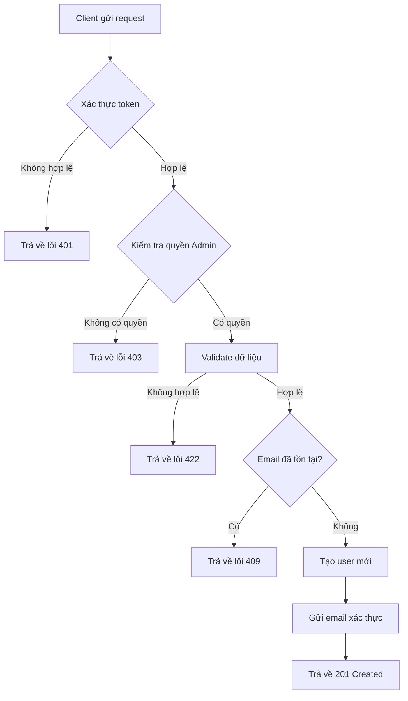

Tài liệu này mô tả cấu trúc chuẩn cho việc viết documentation trong các dự án lớn. Mục tiêu là đảm bảo tính nhất quán, dễ bảo trì và dễ hiểu cho tất cả thành viên trong team.

> [!NOTE]
> Toàn bộ tài liệu này sử dụng **User Management API** làm ví dụ minh họa xuyên suốt. Khi áp dụng cho dự án của bạn, hãy thay thế bằng domain/module tương ứng.

<!--more-->

## Tổng Quan

Mỗi tài liệu trong dự án cần tuân theo cấu trúc sau:

1. **Giới thiệu** - Mô tả tổng quan về tính năng/module
2. **Business Logic** - Giải thích nghiệp vụ và quy trình
3. **Logic Thực Thi** - Chi tiết kỹ thuật triển khai
4. **API Reference** - Tài liệu API đầy đủ (CRUD: Create, Read, Update, Delete)
5. **Testing** - Hướng dẫn kiểm thử
6. **Troubleshooting** - Xử lý sự cố thường gặp

---

## 1. Giới Thiệu

Phần này cung cấp cái nhìn tổng quan về tính năng hoặc module.

### Mục đích

Mô tả ngắn gọn mục đích của tính năng này trong hệ thống.

> **Ví dụ (User Management):** Module User Management cung cấp các chức năng quản lý người dùng trong hệ thống, bao gồm tạo mới, cập nhật, xóa và truy vấn thông tin người dùng.

### Phạm vi

- Những gì tính năng này **làm được**
- Những gì tính năng này **không làm được**
- Các module/service liên quan

### Yêu cầu tiên quyết

| Yêu cầu | Phiên bản | Ghi chú |
| :------ | :-------- | :------ |
| Node.js | >= 18.0   | Bắt buộc |
| Redis   | >= 7.0    | Cho caching |
| PostgreSQL | >= 15  | Database chính |

---

## 2. Business Logic

### Quy trình nghiệp vụ

Mô tả luồng nghiệp vụ chính của tính năng bằng sơ đồ.

> **Ví dụ (User Management):** Quy trình xử lý request tạo user mới:



### Các quy tắc nghiệp vụ

| STT | Quy tắc | Mô tả |
| :-- | :------ | :---- |
| 1 | Xác thực bắt buộc | Tất cả request phải có token hợp lệ |
| 2 | Rate limiting | Tối đa 100 request/phút/user |
| 3 | Validation | Dữ liệu đầu vào phải qua validation |

### Các trường hợp đặc biệt

- **Trường hợp 1**: Khi user chưa verify email → Chỉ cho phép đọc, không cho phép ghi
- **Trường hợp 2**: Khi hệ thống quá tải → Trả về 503 và retry-after header

---

## 3. Logic Thực Thi

### Kiến trúc kỹ thuật

```
┌─────────────────┐     ┌─────────────────┐     ┌─────────────────┐
│   API Gateway   │────▶│   Auth Service  │────▶│   User Service  │
└─────────────────┘     └─────────────────┘     └─────────────────┘
         │                                               │
         │                                               ▼
         │                                      ┌─────────────────┐
         └─────────────────────────────────────▶│    Database     │
                                                └─────────────────┘
```

### Luồng xử lý chi tiết



### Bước 1: Nhận Request

Client gửi request đến API Gateway. Gateway thực hiện:
- Validate format request
- Extract JWT token từ header
- Forward đến service tương ứng

### Bước 2: Xác thực

Auth Service kiểm tra:
- Token có hợp lệ không
- Token có hết hạn không
- User có quyền truy cập không

### Bước 3: Xử lý nghiệp vụ

Service xử lý logic nghiệp vụ:
- Validate dữ liệu đầu vào
- Thực hiện business logic
- Tương tác với database

### Bước 4: Trả kết quả

Đóng gói response và trả về client với format chuẩn.



### Cấu trúc thư mục


  
    
      
      
    
    
      
      
    
    
      
    
    
      
      
    
  


---

## 4. API Reference

> [!NOTE]
> Phần này minh họa cách viết tài liệu API đầy đủ với 5 endpoint CRUD cơ bản. Ví dụ sử dụng **User Management API**.

### Tổng quan các Endpoint

| Method | Endpoint | Mô tả | Quyền |
| :----- | :------- | :---- | :---- |
| `GET` | `/api/v1/users` | Lấy danh sách users (có phân trang) | Admin |
| `GET` | `/api/v1/users/{id}` | Lấy thông tin chi tiết user | User/Admin |
| `POST` | `/api/v1/users` | Tạo user mới | Admin |
| `PUT` | `/api/v1/users/{id}` | Cập nhật thông tin user | User/Admin |
| `DELETE` | `/api/v1/users/{id}` | Xóa user | Admin |

---

### 4.1 Lấy danh sách Users

Lấy danh sách người dùng với hỗ trợ phân trang, lọc và sắp xếp.

#### Thông tin cơ bản

| Thuộc tính | Giá trị |
| :--------- | :------ |
| **Method** | `GET` |
| **URL** | `/api/v1/users` |
| **Authentication** | Bearer Token (Admin) |

#### Query Parameters

| Parameter | Kiểu | Bắt buộc | Mô tả | Mặc định |
| :-------- | :--- | :------- | :---- | :------- |
| `page` | integer | ❌ | Số trang (bắt đầu từ 1) | `1` |
| `limit` | integer | ❌ | Số record mỗi trang (tối đa 100) | `20` |
| `sort` | string | ❌ | Trường sắp xếp: `createdAt`, `email`, `fullName` | `createdAt` |
| `order` | string | ❌ | Thứ tự: `asc` hoặc `desc` | `desc` |
| `status` | string | ❌ | Lọc theo status: `active`, `pending_verification`, `suspended` | - |
| `role` | string | ❌ | Lọc theo role: `user`, `admin`, `moderator` | - |
| `search` | string | ❌ | Tìm kiếm theo email hoặc tên | - |

#### Headers

| Header | Kiểu | Bắt buộc | Mô tả |
| :----- | :--- | :------- | :---- |
| `Authorization` | string | ✅ | Token xác thực. Format: `Bearer <token>` |
| `X-Request-ID` | string | ❌ | ID để tracking request |

#### cURL

```bash
curl --request GET \
  --url 'https://api.example.com/api/v1/users?page=1&limit=10&status=active&sort=createdAt&order=desc' \
  --header 'Authorization: Bearer <your_admin_token>'
```

#### Response thành công

**Status Code:** `200 OK`

```json
{
  "success": true,
  "data": [
    {
      "id": "usr_01HQ3K5XJPZ8VWMN4YGCR2BDEF",
      "email": "user1@example.com",
      "fullName": "Nguyễn Văn A",
      "role": "user",
      "status": "active",
      "createdAt": "2024-02-20T10:30:00.000Z"
    },
    {
      "id": "usr_01HQ3K5XJPZ8VWMN4YGCR2BGHI",
      "email": "user2@example.com",
      "fullName": "Trần Thị B",
      "role": "admin",
      "status": "active",
      "createdAt": "2024-02-19T08:00:00.000Z"
    }
  ],
  "pagination": {
    "page": 1,
    "limit": 10,
    "totalItems": 156,
    "totalPages": 16,
    "hasNextPage": true,
    "hasPrevPage": false
  },
  "meta": {
    "requestId": "req-345678",
    "timestamp": "2024-02-20T10:40:00.000Z"
  }
}
```

#### Response lỗi




```json
{
  "success": false,
  "error": {
    "code": "UNAUTHORIZED",
    "message": "Token không hợp lệ hoặc đã hết hạn"
  },
  "meta": {
    "requestId": "req-345678",
    "timestamp": "2024-02-20T10:40:00.000Z"
  }
}
```



```json
{
  "success": false,
  "error": {
    "code": "FORBIDDEN",
    "message": "Không có quyền truy cập",
    "details": "Chỉ Admin mới có quyền xem danh sách users"
  },
  "meta": {
    "requestId": "req-345678",
    "timestamp": "2024-02-20T10:40:00.000Z"
  }
}
```




---

### 4.2 Lấy thông tin chi tiết User

Lấy thông tin chi tiết của một người dùng theo ID.

#### Thông tin cơ bản

| Thuộc tính | Giá trị |
| :--------- | :------ |
| **Method** | `GET` |
| **URL** | `/api/v1/users/{id}` |
| **Authentication** | Bearer Token |

#### Path Parameters

| Parameter | Kiểu | Bắt buộc | Mô tả |
| :-------- | :--- | :------- | :---- |
| `id` | string | ✅ | ID của user. Format: `usr_<ULID>` |

#### Headers

| Header | Kiểu | Bắt buộc | Mô tả |
| :----- | :--- | :------- | :---- |
| `Authorization` | string | ✅ | Token xác thực. Format: `Bearer <token>` |

#### cURL

```bash
curl --request GET \
  --url 'https://api.example.com/api/v1/users/usr_01HQ3K5XJPZ8VWMN4YGCR2BDEF' \
  --header 'Authorization: Bearer <your_token>'
```

#### Response thành công

**Status Code:** `200 OK`

```json
{
  "success": true,
  "data": {
    "id": "usr_01HQ3K5XJPZ8VWMN4YGCR2BDEF",
    "email": "user@example.com",
    "fullName": "Nguyễn Văn A",
    "phoneNumber": "+84901234567",
    "role": "user",
    "status": "active",
    "metadata": {
      "department": "Engineering",
      "employeeId": "EMP001"
    },
    "lastLoginAt": "2024-02-20T09:00:00.000Z",
    "createdAt": "2024-02-15T10:30:00.000Z",
    "updatedAt": "2024-02-20T09:00:00.000Z"
  },
  "meta": {
    "requestId": "req-789012",
    "timestamp": "2024-02-20T10:35:00.000Z"
  }
}
```

#### Chi tiết các thuộc tính Response

| Thuộc tính | Kiểu | Mô tả |
| :--------- | :--- | :---- |
| `id` | string | ID duy nhất của user, format ULID với prefix `usr_` |
| `email` | string | Email đã đăng ký |
| `fullName` | string | Họ tên đầy đủ |
| `phoneNumber` | string \| null | Số điện thoại (nếu có) |
| `role` | string | Vai trò: `user`, `admin`, `moderator` |
| `status` | string | Trạng thái: `pending_verification`, `active`, `suspended`, `deleted` |
| `metadata` | object \| null | Thông tin bổ sung tùy chỉnh |
| `lastLoginAt` | string \| null | Thời điểm đăng nhập cuối (ISO 8601) |
| `createdAt` | string | Thời điểm tạo (ISO 8601) |
| `updatedAt` | string | Thời điểm cập nhật cuối (ISO 8601) |

#### Response lỗi




```json
{
  "success": false,
  "error": {
    "code": "UNAUTHORIZED",
    "message": "Token không hợp lệ hoặc đã hết hạn"
  },
  "meta": {
    "requestId": "req-789012",
    "timestamp": "2024-02-20T10:35:00.000Z"
  }
}
```



```json
{
  "success": false,
  "error": {
    "code": "FORBIDDEN",
    "message": "Không có quyền truy cập tài nguyên này",
    "details": "Bạn chỉ có thể xem thông tin của chính mình"
  },
  "meta": {
    "requestId": "req-789012",
    "timestamp": "2024-02-20T10:35:00.000Z"
  }
}
```



```json
{
  "success": false,
  "error": {
    "code": "NOT_FOUND",
    "message": "Không tìm thấy người dùng",
    "details": "User với ID usr_01HQ3K5XJPZ8VWMN4YGCR2BDEF không tồn tại"
  },
  "meta": {
    "requestId": "req-789012",
    "timestamp": "2024-02-20T10:35:00.000Z"
  }
}
```




---

### 4.3 Tạo User mới (Create)

Tạo một tài khoản người dùng mới trong hệ thống.

#### Thông tin cơ bản

| Thuộc tính | Giá trị |
| :--------- | :------ |
| **Method** | `POST` |
| **URL** | `/api/v1/users` |
| **Authentication** | Bearer Token (Admin) |
| **Content-Type** | `application/json` |

#### Headers

| Header | Kiểu | Bắt buộc | Mô tả |
| :----- | :--- | :------- | :---- |
| `Authorization` | string | ✅ | Token xác thực. Format: `Bearer <token>` |
| `Content-Type` | string | ✅ | Phải là `application/json` |
| `X-Request-ID` | string | ❌ | ID để tracking request |

#### Request Body

```json
{
  "email": "newuser@example.com",
  "password": "SecureP@ss123",
  "fullName": "Nguyễn Văn A",
  "phoneNumber": "+84901234567",
  "role": "user",
  "metadata": {
    "department": "Engineering",
    "employeeId": "EMP001"
  }
}
```

#### Chi tiết các thuộc tính Request

| Thuộc tính | Kiểu | Bắt buộc | Mô tả | Ràng buộc |
| :--------- | :--- | :------- | :---- | :-------- |
| `email` | string | ✅ | Địa chỉ email, dùng làm username | Email hợp lệ, tối đa 255 ký tự, unique |
| `password` | string | ✅ | Mật khẩu đăng nhập | Tối thiểu 8 ký tự, phải có chữ hoa, chữ thường, số và ký tự đặc biệt |
| `fullName` | string | ✅ | Họ và tên đầy đủ | 2-100 ký tự |
| `phoneNumber` | string | ❌ | Số điện thoại | Format E.164 (ví dụ: +84901234567) |
| `role` | string | ❌ | Vai trò của người dùng | `user` \| `admin` \| `moderator`. Mặc định: `user` |
| `metadata` | object | ❌ | Thông tin bổ sung | Object JSON, tối đa 10KB |

#### cURL

```bash
curl --request POST \
  --url 'https://api.example.com/api/v1/users' \
  --header 'Authorization: Bearer <your_admin_token>' \
  --header 'Content-Type: application/json' \
  --data '{
    "email": "newuser@example.com",
    "password": "SecureP@ss123",
    "fullName": "Nguyễn Văn A",
    "phoneNumber": "+84901234567",
    "role": "user",
    "metadata": {
      "department": "Engineering",
      "employeeId": "EMP001"
    }
  }'
```

#### Response thành công

**Status Code:** `201 Created`

```json
{
  "success": true,
  "data": {
    "id": "usr_01HQ3K5XJPZ8VWMN4YGCR2BDEF",
    "email": "newuser@example.com",
    "fullName": "Nguyễn Văn A",
    "phoneNumber": "+84901234567",
    "role": "user",
    "status": "pending_verification",
    "metadata": {
      "department": "Engineering",
      "employeeId": "EMP001"
    },
    "createdAt": "2024-02-20T10:30:00.000Z",
    "updatedAt": "2024-02-20T10:30:00.000Z"
  },
  "meta": {
    "requestId": "req-123456",
    "timestamp": "2024-02-20T10:30:00.000Z"
  }
}
```

#### Response lỗi




**Nguyên nhân:** Request body không đúng format JSON.

```json
{
  "success": false,
  "error": {
    "code": "BAD_REQUEST",
    "message": "Request body không hợp lệ",
    "details": "Không thể parse JSON body"
  },
  "meta": {
    "requestId": "req-123456",
    "timestamp": "2024-02-20T10:30:00.000Z"
  }
}
```



**Nguyên nhân:** Token không hợp lệ hoặc hết hạn.

```json
{
  "success": false,
  "error": {
    "code": "UNAUTHORIZED",
    "message": "Token không hợp lệ hoặc đã hết hạn",
    "details": "Vui lòng đăng nhập lại để lấy token mới"
  },
  "meta": {
    "requestId": "req-123456",
    "timestamp": "2024-02-20T10:30:00.000Z"
  }
}
```



**Nguyên nhân:** User không có quyền Admin.

```json
{
  "success": false,
  "error": {
    "code": "FORBIDDEN",
    "message": "Không có quyền thực hiện thao tác này",
    "details": "Chỉ Admin mới có quyền tạo user mới"
  },
  "meta": {
    "requestId": "req-123456",
    "timestamp": "2024-02-20T10:30:00.000Z"
  }
}
```



**Nguyên nhân:** Email đã tồn tại trong hệ thống.

```json
{
  "success": false,
  "error": {
    "code": "CONFLICT",
    "message": "Email đã được sử dụng",
    "details": "Email newuser@example.com đã tồn tại trong hệ thống"
  },
  "meta": {
    "requestId": "req-123456",
    "timestamp": "2024-02-20T10:30:00.000Z"
  }
}
```



**Nguyên nhân:** Dữ liệu không đạt yêu cầu validation.

```json
{
  "success": false,
  "error": {
    "code": "VALIDATION_ERROR",
    "message": "Dữ liệu không hợp lệ",
    "details": [
      {
        "field": "password",
        "message": "Mật khẩu phải có ít nhất 8 ký tự, bao gồm chữ hoa, chữ thường, số và ký tự đặc biệt"
      },
      {
        "field": "phoneNumber",
        "message": "Số điện thoại không đúng format E.164"
      }
    ]
  },
  "meta": {
    "requestId": "req-123456",
    "timestamp": "2024-02-20T10:30:00.000Z"
  }
}
```




---

### 4.4 Cập nhật User (Update)

Cập nhật thông tin của một người dùng.

#### Thông tin cơ bản

| Thuộc tính | Giá trị |
| :--------- | :------ |
| **Method** | `PUT` |
| **URL** | `/api/v1/users/{id}` |
| **Authentication** | Bearer Token |
| **Content-Type** | `application/json` |

#### Path Parameters

| Parameter | Kiểu | Bắt buộc | Mô tả |
| :-------- | :--- | :------- | :---- |
| `id` | string | ✅ | ID của user cần cập nhật. Format: `usr_<ULID>` |

#### Headers

| Header | Kiểu | Bắt buộc | Mô tả |
| :----- | :--- | :------- | :---- |
| `Authorization` | string | ✅ | Token xác thực. Format: `Bearer <token>` |
| `Content-Type` | string | ✅ | Phải là `application/json` |

#### Request Body

> [!NOTE]
> Chỉ cần gửi các trường muốn cập nhật. Các trường không gửi sẽ giữ nguyên giá trị cũ.

```json
{
  "fullName": "Nguyễn Văn B",
  "phoneNumber": "+84909876543",
  "metadata": {
    "department": "Marketing",
    "employeeId": "EMP002"
  }
}
```

#### Chi tiết các thuộc tính Request

| Thuộc tính | Kiểu | Bắt buộc | Mô tả | Ràng buộc |
| :--------- | :--- | :------- | :---- | :-------- |
| `fullName` | string | ❌ | Họ và tên mới | 2-100 ký tự |
| `phoneNumber` | string | ❌ | Số điện thoại mới | Format E.164 |
| `role` | string | ❌ | Vai trò mới (chỉ Admin) | `user` \| `admin` \| `moderator` |
| `status` | string | ❌ | Trạng thái mới (chỉ Admin) | `active` \| `suspended` |
| `metadata` | object | ❌ | Thông tin bổ sung | Object JSON, tối đa 10KB |

> [!WARNING]
> Các trường `email` và `password` không thể cập nhật qua endpoint này. Sử dụng endpoint riêng cho đổi email/password.

#### cURL

```bash
curl --request PUT \
  --url 'https://api.example.com/api/v1/users/usr_01HQ3K5XJPZ8VWMN4YGCR2BDEF' \
  --header 'Authorization: Bearer <your_token>' \
  --header 'Content-Type: application/json' \
  --data '{
    "fullName": "Nguyễn Văn B",
    "phoneNumber": "+84909876543",
    "metadata": {
      "department": "Marketing",
      "employeeId": "EMP002"
    }
  }'
```

#### Response thành công

**Status Code:** `200 OK`

```json
{
  "success": true,
  "data": {
    "id": "usr_01HQ3K5XJPZ8VWMN4YGCR2BDEF",
    "email": "user@example.com",
    "fullName": "Nguyễn Văn B",
    "phoneNumber": "+84909876543",
    "role": "user",
    "status": "active",
    "metadata": {
      "department": "Marketing",
      "employeeId": "EMP002"
    },
    "createdAt": "2024-02-15T10:30:00.000Z",
    "updatedAt": "2024-02-20T14:00:00.000Z"
  },
  "meta": {
    "requestId": "req-456789",
    "timestamp": "2024-02-20T14:00:00.000Z"
  }
}
```

#### Response lỗi




```json
{
  "success": false,
  "error": {
    "code": "UNAUTHORIZED",
    "message": "Token không hợp lệ hoặc đã hết hạn"
  },
  "meta": {
    "requestId": "req-456789",
    "timestamp": "2024-02-20T14:00:00.000Z"
  }
}
```



**Nguyên nhân:** User không có quyền cập nhật user khác, hoặc không phải Admin khi cập nhật role/status.

```json
{
  "success": false,
  "error": {
    "code": "FORBIDDEN",
    "message": "Không có quyền cập nhật tài nguyên này",
    "details": "Bạn chỉ có thể cập nhật thông tin của chính mình"
  },
  "meta": {
    "requestId": "req-456789",
    "timestamp": "2024-02-20T14:00:00.000Z"
  }
}
```



```json
{
  "success": false,
  "error": {
    "code": "NOT_FOUND",
    "message": "Không tìm thấy người dùng",
    "details": "User với ID usr_01HQ3K5XJPZ8VWMN4YGCR2BDEF không tồn tại"
  },
  "meta": {
    "requestId": "req-456789",
    "timestamp": "2024-02-20T14:00:00.000Z"
  }
}
```



```json
{
  "success": false,
  "error": {
    "code": "VALIDATION_ERROR",
    "message": "Dữ liệu không hợp lệ",
    "details": [
      {
        "field": "phoneNumber",
        "message": "Số điện thoại không đúng format E.164"
      }
    ]
  },
  "meta": {
    "requestId": "req-456789",
    "timestamp": "2024-02-20T14:00:00.000Z"
  }
}
```




---

### 4.5 Xóa User (Delete)

Xóa một người dùng khỏi hệ thống.

#### Thông tin cơ bản

| Thuộc tính | Giá trị |
| :--------- | :------ |
| **Method** | `DELETE` |
| **URL** | `/api/v1/users/{id}` |
| **Authentication** | Bearer Token (Admin) |

#### Path Parameters

| Parameter | Kiểu | Bắt buộc | Mô tả |
| :-------- | :--- | :------- | :---- |
| `id` | string | ✅ | ID của user cần xóa. Format: `usr_<ULID>` |

#### Headers

| Header | Kiểu | Bắt buộc | Mô tả |
| :----- | :--- | :------- | :---- |
| `Authorization` | string | ✅ | Token xác thực. Format: `Bearer <token>` |

#### Query Parameters (Optional)

| Parameter | Kiểu | Bắt buộc | Mô tả | Mặc định |
| :-------- | :--- | :------- | :---- | :------- |
| `hard` | boolean | ❌ | `true` = xóa vĩnh viễn, `false` = soft delete | `false` |

> [!WARNING]
> Khi `hard=true`, dữ liệu sẽ bị xóa vĩnh viễn và không thể khôi phục. Mặc định sử dụng soft delete (chuyển status thành `deleted`).

#### cURL

```bash
# Soft delete (mặc định)
curl --request DELETE \
  --url 'https://api.example.com/api/v1/users/usr_01HQ3K5XJPZ8VWMN4YGCR2BDEF' \
  --header 'Authorization: Bearer <your_admin_token>'

# Hard delete (xóa vĩnh viễn)
curl --request DELETE \
  --url 'https://api.example.com/api/v1/users/usr_01HQ3K5XJPZ8VWMN4YGCR2BDEF?hard=true' \
  --header 'Authorization: Bearer <your_admin_token>'
```

#### Response thành công

**Status Code:** `200 OK`

```json
{
  "success": true,
  "data": {
    "id": "usr_01HQ3K5XJPZ8VWMN4YGCR2BDEF",
    "deleted": true,
    "deletedAt": "2024-02-20T15:00:00.000Z",
    "hardDelete": false
  },
  "meta": {
    "requestId": "req-567890",
    "timestamp": "2024-02-20T15:00:00.000Z"
  }
}
```

#### Response lỗi




```json
{
  "success": false,
  "error": {
    "code": "UNAUTHORIZED",
    "message": "Token không hợp lệ hoặc đã hết hạn"
  },
  "meta": {
    "requestId": "req-567890",
    "timestamp": "2024-02-20T15:00:00.000Z"
  }
}
```



```json
{
  "success": false,
  "error": {
    "code": "FORBIDDEN",
    "message": "Không có quyền xóa user",
    "details": "Chỉ Admin mới có quyền xóa user"
  },
  "meta": {
    "requestId": "req-567890",
    "timestamp": "2024-02-20T15:00:00.000Z"
  }
}
```



```json
{
  "success": false,
  "error": {
    "code": "NOT_FOUND",
    "message": "Không tìm thấy người dùng",
    "details": "User với ID usr_01HQ3K5XJPZ8VWMN4YGCR2BDEF không tồn tại"
  },
  "meta": {
    "requestId": "req-567890",
    "timestamp": "2024-02-20T15:00:00.000Z"
  }
}
```



**Nguyên nhân:** Không thể xóa user do có ràng buộc dữ liệu.

```json
{
  "success": false,
  "error": {
    "code": "CONFLICT",
    "message": "Không thể xóa user",
    "details": "User này đang có dữ liệu liên quan. Vui lòng xóa hoặc chuyển dữ liệu trước."
  },
  "meta": {
    "requestId": "req-567890",
    "timestamp": "2024-02-20T15:00:00.000Z"
  }
}
```




---

## 5. Testing

### Unit Tests

Các file test cho module:


  
    
      
      
    
    
      
    
    
      
    
  


### Chạy tests

```bash
# Chạy tất cả unit tests
npm run test:unit

# Chạy integration tests
npm run test:integration

# Chạy e2e tests
npm run test:e2e

# Chạy tests với coverage
npm run test:coverage
```

### Test cases quan trọng

| Test Case | Mô tả | Expected Result |
| :-------- | :---- | :-------------- |
| TC-001 | GET /users - Lấy danh sách với phân trang | Status 200, trả về đúng số record |
| TC-002 | GET /users/:id - Lấy user tồn tại | Status 200, trả về thông tin user |
| TC-003 | GET /users/:id - Lấy user không tồn tại | Status 404, error NOT_FOUND |
| TC-004 | POST /users - Tạo user với dữ liệu hợp lệ | Status 201, user được tạo |
| TC-005 | POST /users - Tạo user với email trùng | Status 409, error CONFLICT |
| TC-006 | POST /users - Tạo user với password yếu | Status 422, validation error |
| TC-007 | PUT /users/:id - Cập nhật thành công | Status 200, dữ liệu được cập nhật |
| TC-008 | PUT /users/:id - Cập nhật user khác (không phải admin) | Status 403, error FORBIDDEN |
| TC-009 | DELETE /users/:id - Soft delete | Status 200, status chuyển thành deleted |
| TC-010 | DELETE /users/:id - Hard delete | Status 200, record bị xóa khỏi DB |
| TC-011 | Truy cập không có token | Status 401, error UNAUTHORIZED |

---

## 6. Troubleshooting

### Các lỗi thường gặp


**Lỗi: "Token không hợp lệ" (401)**

**Nguyên nhân có thể:**
- Token đã hết hạn
- Token bị sai format
- Secret key không khớp

**Cách xử lý:**
1. Kiểm tra token có đúng format `Bearer <token>` không
2. Decode token để kiểm tra thời gian hết hạn
3. Đăng nhập lại để lấy token mới



**Lỗi: "Rate limit exceeded" (429)**

**Nguyên nhân:** Vượt quá giới hạn 100 request/phút

**Cách xử lý:**
1. Kiểm tra header `Retry-After` để biết thời gian chờ
2. Implement exponential backoff trong client
3. Liên hệ admin nếu cần tăng limit



**Lỗi: "Validation Error" (422)**

**Nguyên nhân:** Dữ liệu gửi lên không đúng format hoặc ràng buộc

**Cách xử lý:**
1. Đọc kỹ `details` trong response để biết trường nào lỗi
2. Kiểm tra lại ràng buộc của từng trường trong tài liệu
3. Sửa dữ liệu và gửi lại request


### Liên hệ hỗ trợ

Nếu gặp vấn đề không thể tự xử lý:

- **Email:** support@example.com
- **Slack:** #api-support
- **Documentation:** https://docs.example.com

---

## 7. Changelog

| Phiên bản | Ngày | Thay đổi |
| :-------- | :--- | :------- |
| v1.3.0 | 2024-02-20 | Thêm endpoint DELETE với soft/hard delete |
| v1.2.0 | 2024-02-15 | Thêm endpoint PUT để cập nhật user |
| v1.1.0 | 2024-02-01 | Thêm API phân trang, filter và search |
| v1.0.0 | 2024-01-15 | Release đầu tiên với GET và POST |

---

## Tài liệu liên quan


  
  
  

