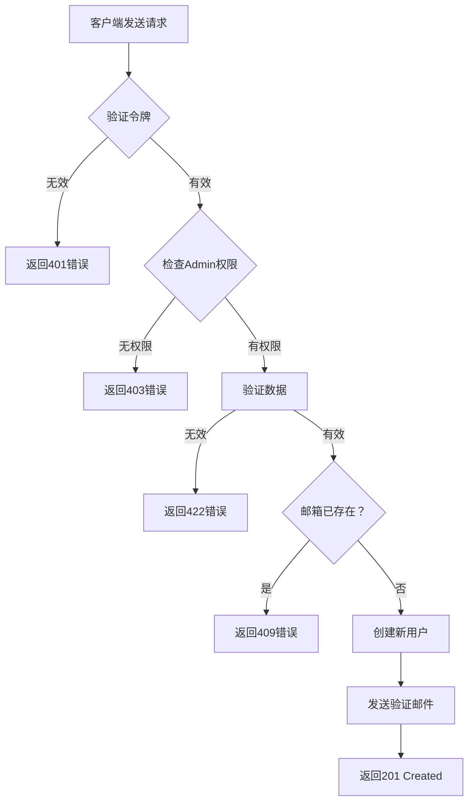

本文档描述了大型项目中编写文档的标准结构。目标是确保所有团队成员的一致性、可维护性和清晰度。

> [!NOTE]
> 本文档全程使用 **User Management API** 作为示例说明。应用到您的项目时，请替换为相应的领域/模块。

<!--more-->

## 概述

项目中的每个文档都应遵循以下结构：

1. **简介** - 功能/模块概述
2. **业务逻辑** - 业务流程说明
3. **实现逻辑** - 技术实现细节
4. **API参考** - 完整的API文档（CRUD: Create, Read, Update, Delete）
5. **测试** - 测试指南
6. **故障排除** - 常见问题解决

---

## 1. 简介

本节提供功能或模块的概述。

### 目的

简要描述此功能在系统中的目的。

> **示例（User Management）：** User Management模块提供系统中的用户管理功能，包括创建、更新、删除和查询用户信息。

### 范围

- 此功能**能做什么**
- 此功能**不能做什么**
- 相关模块/服务

### 前置条件

| 要求 | 版本 | 备注 |
| :--- | :--- | :--- |
| Node.js | >= 18.0 | 必需 |
| Redis | >= 7.0 | 用于缓存 |
| PostgreSQL | >= 15 | 主数据库 |

---

## 2. 业务逻辑

### 业务流程

使用图表描述功能的主要业务流程。

> **示例（User Management）：** 创建新用户的流程：



### 业务规则

| # | 规则 | 描述 |
| :- | :-- | :--- |
| 1 | 需要认证 | 所有请求必须有有效令牌 |
| 2 | 速率限制 | 每用户最多100请求/分钟 |
| 3 | 验证 | 输入数据必须通过验证 |

### 特殊情况

- **情况1**: 当用户未验证邮箱时 → 仅允许读取，不允许写入操作
- **情况2**: 当系统过载时 → 返回503和retry-after头

---

## 3. 实现逻辑

### 技术架构

```
┌─────────────────┐     ┌─────────────────┐     ┌─────────────────┐
│   API Gateway   │────▶│   Auth Service  │────▶│   User Service  │
└─────────────────┘     └─────────────────┘     └─────────────────┘
         │                                               │
         │                                               ▼
         │                                      ┌─────────────────┐
         └─────────────────────────────────────▶│    Database     │
                                                └─────────────────┘
```

### 详细处理流程



### 步骤1: 接收请求

客户端向API Gateway发送请求。Gateway执行：
- 验证请求格式
- 从头部提取JWT令牌
- 转发到相应服务

### 步骤2: 认证

Auth Service检查：
- 令牌是否有效？
- 令牌是否过期？
- 用户是否有访问权限？

### 步骤3: 处理业务逻辑

服务处理业务逻辑：
- 验证输入数据
- 执行业务逻辑
- 与数据库交互

### 步骤4: 返回结果

打包响应并以标准格式返回给客户端。



### 目录结构


  
    
      
      
    
    
      
      
    
    
      
    
    
      
      
    
  


---

## 4. API参考

> [!NOTE]
> 本节演示如何使用5个基本CRUD端点编写完整的API文档。示例使用 **User Management API**。

### 端点概述

| 方法 | 端点 | 描述 | 权限 |
| :-- | :--- | :--- | :--- |
| `GET` | `/api/v1/users` | 用户列表（带分页） | Admin |
| `GET` | `/api/v1/users/{id}` | 获取用户详情 | User/Admin |
| `POST` | `/api/v1/users` | 创建新用户 | Admin |
| `PUT` | `/api/v1/users/{id}` | 更新用户信息 | User/Admin |
| `DELETE` | `/api/v1/users/{id}` | 删除用户 | Admin |

---

### 4.1 用户列表

获取支持分页、过滤和排序的用户列表。

#### 基本信息

| 属性 | 值 |
| :-- | :- |
| **方法** | `GET` |
| **URL** | `/api/v1/users` |
| **认证** | Bearer Token (Admin) |

#### 查询参数

| 参数 | 类型 | 必需 | 描述 | 默认值 |
| :-- | :-- | :-- | :--- | :---- |
| `page` | integer | ❌ | 页码（从1开始） | `1` |
| `limit` | integer | ❌ | 每页记录数（最大100） | `20` |
| `sort` | string | ❌ | 排序字段: `createdAt`, `email`, `fullName` | `createdAt` |
| `order` | string | ❌ | 顺序: `asc` 或 `desc` | `desc` |
| `status` | string | ❌ | 按状态过滤: `active`, `pending_verification`, `suspended` | - |
| `role` | string | ❌ | 按角色过滤: `user`, `admin`, `moderator` | - |
| `search` | string | ❌ | 按邮箱或姓名搜索 | - |

#### 请求头

| 头部 | 类型 | 必需 | 描述 |
| :-- | :-- | :-- | :--- |
| `Authorization` | string | ✅ | 认证令牌。格式: `Bearer <token>` |
| `X-Request-ID` | string | ❌ | 请求追踪ID |

#### cURL

```bash
curl --request GET \
  --url 'https://api.example.com/api/v1/users?page=1&limit=10&status=active&sort=createdAt&order=desc' \
  --header 'Authorization: Bearer <your_admin_token>'
```

#### 成功响应

**状态码:** `200 OK`

```json
{
  "success": true,
  "data": [
    {
      "id": "usr_01HQ3K5XJPZ8VWMN4YGCR2BDEF",
      "email": "user1@example.com",
      "fullName": "张三",
      "role": "user",
      "status": "active",
      "createdAt": "2024-02-20T10:30:00.000Z"
    },
    {
      "id": "usr_01HQ3K5XJPZ8VWMN4YGCR2BGHI",
      "email": "user2@example.com",
      "fullName": "李四",
      "role": "admin",
      "status": "active",
      "createdAt": "2024-02-19T08:00:00.000Z"
    }
  ],
  "pagination": {
    "page": 1,
    "limit": 10,
    "totalItems": 156,
    "totalPages": 16,
    "hasNextPage": true,
    "hasPrevPage": false
  },
  "meta": {
    "requestId": "req-345678",
    "timestamp": "2024-02-20T10:40:00.000Z"
  }
}
```

#### 错误响应




```json
{
  "success": false,
  "error": {
    "code": "UNAUTHORIZED",
    "message": "令牌无效或已过期"
  },
  "meta": {
    "requestId": "req-345678",
    "timestamp": "2024-02-20T10:40:00.000Z"
  }
}
```



```json
{
  "success": false,
  "error": {
    "code": "FORBIDDEN",
    "message": "访问被拒绝",
    "details": "只有Admin可以查看用户列表"
  },
  "meta": {
    "requestId": "req-345678",
    "timestamp": "2024-02-20T10:40:00.000Z"
  }
}
```




---

### 4.2 获取用户详情

通过ID获取用户的详细信息。

#### 基本信息

| 属性 | 值 |
| :-- | :- |
| **方法** | `GET` |
| **URL** | `/api/v1/users/{id}` |
| **认证** | Bearer Token |

#### 路径参数

| 参数 | 类型 | 必需 | 描述 |
| :-- | :-- | :-- | :--- |
| `id` | string | ✅ | 用户ID。格式: `usr_<ULID>` |

#### 请求头

| 头部 | 类型 | 必需 | 描述 |
| :-- | :-- | :-- | :--- |
| `Authorization` | string | ✅ | 认证令牌。格式: `Bearer <token>` |

#### cURL

```bash
curl --request GET \
  --url 'https://api.example.com/api/v1/users/usr_01HQ3K5XJPZ8VWMN4YGCR2BDEF' \
  --header 'Authorization: Bearer <your_token>'
```

#### 成功响应

**状态码:** `200 OK`

```json
{
  "success": true,
  "data": {
    "id": "usr_01HQ3K5XJPZ8VWMN4YGCR2BDEF",
    "email": "user@example.com",
    "fullName": "张三",
    "phoneNumber": "+8613812345678",
    "role": "user",
    "status": "active",
    "metadata": {
      "department": "Engineering",
      "employeeId": "EMP001"
    },
    "lastLoginAt": "2024-02-20T09:00:00.000Z",
    "createdAt": "2024-02-15T10:30:00.000Z",
    "updatedAt": "2024-02-20T09:00:00.000Z"
  },
  "meta": {
    "requestId": "req-789012",
    "timestamp": "2024-02-20T10:35:00.000Z"
  }
}
```

#### 响应属性详情

| 属性 | 类型 | 描述 |
| :-- | :-- | :--- |
| `id` | string | 唯一用户ID，带`usr_`前缀的ULID格式 |
| `email` | string | 注册邮箱 |
| `fullName` | string | 全名 |
| `phoneNumber` | string \| null | 电话号码（如果提供） |
| `role` | string | 角色: `user`, `admin`, `moderator` |
| `status` | string | 状态: `pending_verification`, `active`, `suspended`, `deleted` |
| `metadata` | object \| null | 自定义附加信息 |
| `lastLoginAt` | string \| null | 最后登录时间戳（ISO 8601） |
| `createdAt` | string | 创建时间戳（ISO 8601） |
| `updatedAt` | string | 最后更新时间戳（ISO 8601） |

#### 错误响应




```json
{
  "success": false,
  "error": {
    "code": "UNAUTHORIZED",
    "message": "令牌无效或已过期"
  },
  "meta": {
    "requestId": "req-789012",
    "timestamp": "2024-02-20T10:35:00.000Z"
  }
}
```



```json
{
  "success": false,
  "error": {
    "code": "FORBIDDEN",
    "message": "拒绝访问此资源",
    "details": "您只能查看自己的信息"
  },
  "meta": {
    "requestId": "req-789012",
    "timestamp": "2024-02-20T10:35:00.000Z"
  }
}
```



```json
{
  "success": false,
  "error": {
    "code": "NOT_FOUND",
    "message": "用户未找到",
    "details": "ID为 usr_01HQ3K5XJPZ8VWMN4YGCR2BDEF 的用户不存在"
  },
  "meta": {
    "requestId": "req-789012",
    "timestamp": "2024-02-20T10:35:00.000Z"
  }
}
```




---

### 4.3 创建用户（Create）

在系统中创建新的用户账户。

#### 基本信息

| 属性 | 值 |
| :-- | :- |
| **方法** | `POST` |
| **URL** | `/api/v1/users` |
| **认证** | Bearer Token (Admin) |
| **Content-Type** | `application/json` |

#### 请求头

| 头部 | 类型 | 必需 | 描述 |
| :-- | :-- | :-- | :--- |
| `Authorization` | string | ✅ | 认证令牌。格式: `Bearer <token>` |
| `Content-Type` | string | ✅ | 必须是 `application/json` |
| `X-Request-ID` | string | ❌ | 请求追踪ID |

#### 请求体

```json
{
  "email": "newuser@example.com",
  "password": "SecureP@ss123",
  "fullName": "张三",
  "phoneNumber": "+8613812345678",
  "role": "user",
  "metadata": {
    "department": "Engineering",
    "employeeId": "EMP001"
  }
}
```

#### 请求属性详情

| 属性 | 类型 | 必需 | 描述 | 约束 |
| :-- | :-- | :-- | :--- | :--- |
| `email` | string | ✅ | 邮箱地址，用作用户名 | 有效邮箱，最多255字符，唯一 |
| `password` | string | ✅ | 登录密码 | 最少8字符，必须包含大写、小写、数字和特殊字符 |
| `fullName` | string | ✅ | 全名 | 2-100字符 |
| `phoneNumber` | string | ❌ | 电话号码 | E.164格式（例如: +8613812345678） |
| `role` | string | ❌ | 用户角色 | `user` \| `admin` \| `moderator`。默认: `user` |
| `metadata` | object | ❌ | 附加信息 | JSON对象，最大10KB |

#### cURL

```bash
curl --request POST \
  --url 'https://api.example.com/api/v1/users' \
  --header 'Authorization: Bearer <your_admin_token>' \
  --header 'Content-Type: application/json' \
  --data '{
    "email": "newuser@example.com",
    "password": "SecureP@ss123",
    "fullName": "张三",
    "phoneNumber": "+8613812345678",
    "role": "user",
    "metadata": {
      "department": "Engineering",
      "employeeId": "EMP001"
    }
  }'
```

#### 成功响应

**状态码:** `201 Created`

```json
{
  "success": true,
  "data": {
    "id": "usr_01HQ3K5XJPZ8VWMN4YGCR2BDEF",
    "email": "newuser@example.com",
    "fullName": "张三",
    "phoneNumber": "+8613812345678",
    "role": "user",
    "status": "pending_verification",
    "metadata": {
      "department": "Engineering",
      "employeeId": "EMP001"
    },
    "createdAt": "2024-02-20T10:30:00.000Z",
    "updatedAt": "2024-02-20T10:30:00.000Z"
  },
  "meta": {
    "requestId": "req-123456",
    "timestamp": "2024-02-20T10:30:00.000Z"
  }
}
```

#### 错误响应




**原因:** 请求体不是有效的JSON格式。

```json
{
  "success": false,
  "error": {
    "code": "BAD_REQUEST",
    "message": "请求体无效",
    "details": "无法解析JSON体"
  },
  "meta": {
    "requestId": "req-123456",
    "timestamp": "2024-02-20T10:30:00.000Z"
  }
}
```



**原因:** 令牌无效或过期。

```json
{
  "success": false,
  "error": {
    "code": "UNAUTHORIZED",
    "message": "令牌无效或已过期",
    "details": "请重新登录以获取新令牌"
  },
  "meta": {
    "requestId": "req-123456",
    "timestamp": "2024-02-20T10:30:00.000Z"
  }
}
```



**原因:** 用户没有Admin权限。

```json
{
  "success": false,
  "error": {
    "code": "FORBIDDEN",
    "message": "无权执行此操作",
    "details": "只有Admin可以创建新用户"
  },
  "meta": {
    "requestId": "req-123456",
    "timestamp": "2024-02-20T10:30:00.000Z"
  }
}
```



**原因:** 邮箱已存在于系统中。

```json
{
  "success": false,
  "error": {
    "code": "CONFLICT",
    "message": "邮箱已被使用",
    "details": "邮箱 newuser@example.com 已存在于系统中"
  },
  "meta": {
    "requestId": "req-123456",
    "timestamp": "2024-02-20T10:30:00.000Z"
  }
}
```



**原因:** 数据不符合验证要求。

```json
{
  "success": false,
  "error": {
    "code": "VALIDATION_ERROR",
    "message": "数据无效",
    "details": [
      {
        "field": "password",
        "message": "密码必须至少8个字符，包括大写、小写、数字和特殊字符"
      },
      {
        "field": "phoneNumber",
        "message": "电话号码不符合E.164格式"
      }
    ]
  },
  "meta": {
    "requestId": "req-123456",
    "timestamp": "2024-02-20T10:30:00.000Z"
  }
}
```




---

### 4.4 更新用户（Update）

更新用户的信息。

#### 基本信息

| 属性 | 值 |
| :-- | :- |
| **方法** | `PUT` |
| **URL** | `/api/v1/users/{id}` |
| **认证** | Bearer Token |
| **Content-Type** | `application/json` |

#### 路径参数

| 参数 | 类型 | 必需 | 描述 |
| :-- | :-- | :-- | :--- |
| `id` | string | ✅ | 要更新的用户ID。格式: `usr_<ULID>` |

#### 请求头

| 头部 | 类型 | 必需 | 描述 |
| :-- | :-- | :-- | :--- |
| `Authorization` | string | ✅ | 认证令牌。格式: `Bearer <token>` |
| `Content-Type` | string | ✅ | 必须是 `application/json` |

#### 请求体

> [!NOTE]
> 只需发送要更新的字段。未发送的字段将保留当前值。

```json
{
  "fullName": "李四",
  "phoneNumber": "+8613987654321",
  "metadata": {
    "department": "Marketing",
    "employeeId": "EMP002"
  }
}
```

#### 请求属性详情

| 属性 | 类型 | 必需 | 描述 | 约束 |
| :-- | :-- | :-- | :--- | :--- |
| `fullName` | string | ❌ | 新全名 | 2-100字符 |
| `phoneNumber` | string | ❌ | 新电话号码 | E.164格式 |
| `role` | string | ❌ | 新角色（仅Admin） | `user` \| `admin` \| `moderator` |
| `status` | string | ❌ | 新状态（仅Admin） | `active` \| `suspended` |
| `metadata` | object | ❌ | 附加信息 | JSON对象，最大10KB |

> [!WARNING]
> `email`和`password`字段无法通过此端点更新。请使用专用端点更改邮箱/密码。

#### cURL

```bash
curl --request PUT \
  --url 'https://api.example.com/api/v1/users/usr_01HQ3K5XJPZ8VWMN4YGCR2BDEF' \
  --header 'Authorization: Bearer <your_token>' \
  --header 'Content-Type: application/json' \
  --data '{
    "fullName": "李四",
    "phoneNumber": "+8613987654321",
    "metadata": {
      "department": "Marketing",
      "employeeId": "EMP002"
    }
  }'
```

#### 成功响应

**状态码:** `200 OK`

```json
{
  "success": true,
  "data": {
    "id": "usr_01HQ3K5XJPZ8VWMN4YGCR2BDEF",
    "email": "user@example.com",
    "fullName": "李四",
    "phoneNumber": "+8613987654321",
    "role": "user",
    "status": "active",
    "metadata": {
      "department": "Marketing",
      "employeeId": "EMP002"
    },
    "createdAt": "2024-02-15T10:30:00.000Z",
    "updatedAt": "2024-02-20T14:00:00.000Z"
  },
  "meta": {
    "requestId": "req-456789",
    "timestamp": "2024-02-20T14:00:00.000Z"
  }
}
```

#### 错误响应




```json
{
  "success": false,
  "error": {
    "code": "UNAUTHORIZED",
    "message": "令牌无效或已过期"
  },
  "meta": {
    "requestId": "req-456789",
    "timestamp": "2024-02-20T14:00:00.000Z"
  }
}
```



**原因:** 用户无权更新其他用户，或更新role/status时不是Admin。

```json
{
  "success": false,
  "error": {
    "code": "FORBIDDEN",
    "message": "无权更新此资源",
    "details": "您只能更新自己的信息"
  },
  "meta": {
    "requestId": "req-456789",
    "timestamp": "2024-02-20T14:00:00.000Z"
  }
}
```



```json
{
  "success": false,
  "error": {
    "code": "NOT_FOUND",
    "message": "用户未找到",
    "details": "ID为 usr_01HQ3K5XJPZ8VWMN4YGCR2BDEF 的用户不存在"
  },
  "meta": {
    "requestId": "req-456789",
    "timestamp": "2024-02-20T14:00:00.000Z"
  }
}
```



```json
{
  "success": false,
  "error": {
    "code": "VALIDATION_ERROR",
    "message": "数据无效",
    "details": [
      {
        "field": "phoneNumber",
        "message": "电话号码不符合E.164格式"
      }
    ]
  },
  "meta": {
    "requestId": "req-456789",
    "timestamp": "2024-02-20T14:00:00.000Z"
  }
}
```




---

### 4.5 删除用户（Delete）

从系统中删除用户。

#### 基本信息

| 属性 | 值 |
| :-- | :- |
| **方法** | `DELETE` |
| **URL** | `/api/v1/users/{id}` |
| **认证** | Bearer Token (Admin) |

#### 路径参数

| 参数 | 类型 | 必需 | 描述 |
| :-- | :-- | :-- | :--- |
| `id` | string | ✅ | 要删除的用户ID。格式: `usr_<ULID>` |

#### 请求头

| 头部 | 类型 | 必需 | 描述 |
| :-- | :-- | :-- | :--- |
| `Authorization` | string | ✅ | 认证令牌。格式: `Bearer <token>` |

#### 查询参数（可选）

| 参数 | 类型 | 必需 | 描述 | 默认值 |
| :-- | :-- | :-- | :--- | :---- |
| `hard` | boolean | ❌ | `true` = 永久删除，`false` = 软删除 | `false` |

> [!WARNING]
> 当`hard=true`时，数据将被永久删除且无法恢复。默认使用软删除（将状态更改为`deleted`）。

#### cURL

```bash
# 软删除（默认）
curl --request DELETE \
  --url 'https://api.example.com/api/v1/users/usr_01HQ3K5XJPZ8VWMN4YGCR2BDEF' \
  --header 'Authorization: Bearer <your_admin_token>'

# 硬删除（永久）
curl --request DELETE \
  --url 'https://api.example.com/api/v1/users/usr_01HQ3K5XJPZ8VWMN4YGCR2BDEF?hard=true' \
  --header 'Authorization: Bearer <your_admin_token>'
```

#### 成功响应

**状态码:** `200 OK`

```json
{
  "success": true,
  "data": {
    "id": "usr_01HQ3K5XJPZ8VWMN4YGCR2BDEF",
    "deleted": true,
    "deletedAt": "2024-02-20T15:00:00.000Z",
    "hardDelete": false
  },
  "meta": {
    "requestId": "req-567890",
    "timestamp": "2024-02-20T15:00:00.000Z"
  }
}
```

#### 错误响应




```json
{
  "success": false,
  "error": {
    "code": "UNAUTHORIZED",
    "message": "令牌无效或已过期"
  },
  "meta": {
    "requestId": "req-567890",
    "timestamp": "2024-02-20T15:00:00.000Z"
  }
}
```



```json
{
  "success": false,
  "error": {
    "code": "FORBIDDEN",
    "message": "无权删除用户",
    "details": "只有Admin可以删除用户"
  },
  "meta": {
    "requestId": "req-567890",
    "timestamp": "2024-02-20T15:00:00.000Z"
  }
}
```



```json
{
  "success": false,
  "error": {
    "code": "NOT_FOUND",
    "message": "用户未找到",
    "details": "ID为 usr_01HQ3K5XJPZ8VWMN4YGCR2BDEF 的用户不存在"
  },
  "meta": {
    "requestId": "req-567890",
    "timestamp": "2024-02-20T15:00:00.000Z"
  }
}
```



**原因:** 由于数据约束无法删除用户。

```json
{
  "success": false,
  "error": {
    "code": "CONFLICT",
    "message": "无法删除用户",
    "details": "此用户有关联数据。请先删除或转移数据。"
  },
  "meta": {
    "requestId": "req-567890",
    "timestamp": "2024-02-20T15:00:00.000Z"
  }
}
```




---

## 5. 测试

### 单元测试

模块的测试文件:


  
    
      
      
    
    
      
    
    
      
    
  


### 运行测试

```bash
# 运行所有单元测试
npm run test:unit

# 运行集成测试
npm run test:integration

# 运行e2e测试
npm run test:e2e

# 运行带覆盖率的测试
npm run test:coverage
```

### 重要测试用例

| 测试用例 | 描述 | 预期结果 |
| :------ | :--- | :------ |
| TC-001 | GET /users - 带分页列表 | 状态200，返回正确记录数 |
| TC-002 | GET /users/:id - 获取存在的用户 | 状态200，返回用户信息 |
| TC-003 | GET /users/:id - 获取不存在的用户 | 状态404，错误NOT_FOUND |
| TC-004 | POST /users - 使用有效数据创建 | 状态201，用户已创建 |
| TC-005 | POST /users - 使用重复邮箱创建 | 状态409，错误CONFLICT |
| TC-006 | POST /users - 使用弱密码创建 | 状态422，验证错误 |
| TC-007 | PUT /users/:id - 更新成功 | 状态200，数据已更新 |
| TC-008 | PUT /users/:id - 更新其他用户（非Admin） | 状态403，错误FORBIDDEN |
| TC-009 | DELETE /users/:id - 软删除 | 状态200，状态变为deleted |
| TC-010 | DELETE /users/:id - 硬删除 | 状态200，记录从DB删除 |
| TC-011 | 无令牌访问 | 状态401，错误UNAUTHORIZED |

---

## 6. 故障排除

### 常见错误


**错误: "令牌无效" (401)**

**可能原因:**
- 令牌已过期
- 令牌格式不正确
- 密钥不匹配

**解决方法:**
1. 检查令牌是否为正确格式 `Bearer <token>`
2. 解码令牌检查过期时间
3. 重新登录获取新令牌



**错误: "超出速率限制" (429)**

**原因:** 超过100请求/分钟的限制

**解决方法:**
1. 检查 `Retry-After` 头获取等待时间
2. 在客户端实现指数退避
3. 如需增加限制请联系管理员



**错误: "验证错误" (422)**

**原因:** 提交的数据不符合格式或约束

**解决方法:**
1. 仔细阅读响应中的`details`以确定哪个字段有错误
2. 在文档中查看字段约束
3. 修复数据并重试请求


### 支持联系

如果遇到无法解决的问题:

- **邮箱:** support@example.com
- **Slack:** #api-support
- **文档:** https://docs.example.com

---

## 7. 变更日志

| 版本 | 日期 | 变更 |
| :-- | :--- | :--- |
| v1.3.0 | 2024-02-20 | 添加带软/硬删除的DELETE端点 |
| v1.2.0 | 2024-02-15 | 添加用户更新的PUT端点 |
| v1.1.0 | 2024-02-01 | 添加分页、过滤和搜索API |
| v1.0.0 | 2024-01-15 | 初始发布，包含GET和POST |

---

## 相关文档


  
  
  

